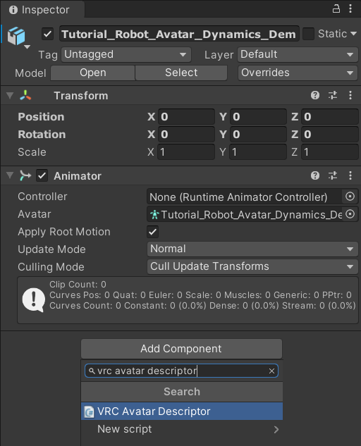
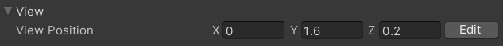
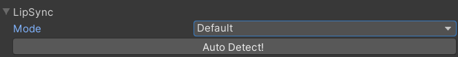
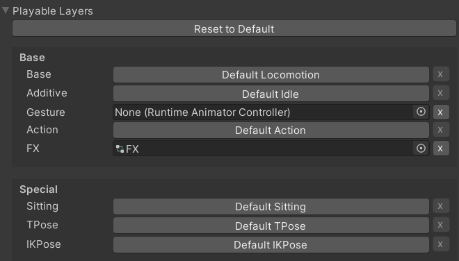
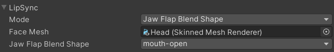

Contributors: [Jellejurre](https://jellejurre.dev/), [JustSleightly](https://vrc.sleightly.dev/)

# VRC Avatar Descriptor {#ae47ea5d972d44b7a5b54d4a44f4ac5a}

The VRC Avatar Descriptor is a component that makes a Unity GameObject an Avatar. 

To add it to your avatar, click the `Add Component` button, type `VRC Avatar Descriptor` in the search box at the top and select the `VRC Avatar Descriptor` script.

Doing this also automatically adds the `Pipeline Manager` script if it is not present yet.

Note that an Animator has to be present on the GameObject for the Avatar to be uploadable, and the Model needs to have a Humanoid Rig for the Avatar to be able to use the default (humanoid) animations.

The Avatar Descriptor is the place where you tell VRChat how your avatar should work in game. Including: 

- Where your viewpoint should be
- How your lips should move
- How your eyes should move
- How the avatar is animated (think movement and toggles and such)
- How your VRC Expression Menus (circle menus) should work
- How the VRC Physbone Colliders on your avatar should be set up

This article will go over how you can customize all this in detail.

 <GreyItalicText>How to add the VRC Avatar Descriptor to your avatar</GreyItalicText>

---

## View Position {#0b37ff9175da463590f5065a3f928123}

The view position is a position in global space which decides where your eyes should be. This location is shown as a Gizmo in the form of a gray ball. If you don’t see this gray ball, this means your gizmos are disabled in the scene view. To move it, press the `Edit` button and move the handles that show up. When done, press the green `Return` button.

The way this view position is used in VRChat is it plays the T-Pose controller, then it compares the location of the view position to the head bone, and saves this offset. This offset is what decides where your view point should be when moving around. 

:::tip

If your view position is in the wrong spot, you can put the VRChat sample T-Pose Controller in the Animator’s Controller Slot, go into play mode, and position the View Position in the right place.

:::

---

## Lip Sync {#fae460a7a92143f4abd8a85832548cd5}

Lip Sync controls the way the avatar’s mouth moves when you talk. There are multiple systems that can be chosen to control this. The Lip Sync header shows a dropdown where you can select the system you want.

### Default {#16769332ab2348a4a1c2a9fae22ecc83}

This is the default value, and has no lip sync attached to it. This only shows the `Auto Detect` button which, when pressed, auto detects the type of Lip Sync you want.

### Viseme Blend Shape

This is the most often used system. It allows you to specify a mesh to have Blend Shapes modified to match the viseme VRChat estimates your face to look like based on your audio.

It has a Skinned Mesh Renderer field where you specify the Skinned Mesh Renderer the have its Blend Shape changed, and when a Skinned Mesh Renderer component present, many Blend Shape dropdowns is shown, where you can select the Blend Shape to be used for every viseme. 

VRChat tries to auto detect them based on the `v_[viseme]` or `vrc.v_[viseme]` being present in the name, as can be seen on the right.

VRChat animates the Built-In parameter `Viseme` from 0 to 14 based on the found value.

See **Advanced Details** below for the other Lip Sync Modes

---

## Eye Look {#44905799a7594db393fa5e41e6b8ef53}

This is the section where you select how your avatar’s eyes look around while playing. It is disabled by default, showing only a big `Enable` button. Pressing this button will enable Eye Look for your avatar, and replace the Enable button with a Disable button, which disables Eye Look.

When enabled, it shows three categories: General, Eyes and Eyelids, each of which have a little arrow which acts as a dropdown.

### General {#7f6f077411c64fa0abe0cd2bd014d004}

In the General tab, you can set how the avatar’s eyes move. It has two sliders: Calm-Excited and Shy-Confident. Calm-Excited decides how much the avatar’s eyes dash around, and Shy-Confident decides how much the avatar’s eyes look at people when talking to them.

### Eyes {#36c13a6b40b146ec8d84ed82b23a297e}

The Eyes tab has two sub-tabs, Transforms and Rotation States. In the Transforms tab, you can select a bone for each eye which will be rotated to perform the eye movements. Note that this shouldn’t be the same bones as set in the Eye bones in the Humanoid rig, or otherwise they won’t be able to be moved by the humanoid rig. 

Generally VRChat avatars come with two sets of bones, one set for the Humanoid Rig (pointing forward), and one for the Avatar Descriptor (pointing up). The reason the Avatar Descriptor ones are pointing up is because this means the default rotation is (0,0,0)

In the Rotation States tab you can set the rotation for the different eye movements (Straight, Up, Down, Right, Left) as x,y,z Euler Angles. You can press `Preview` to preview a rotation, and `Return` to stop previewing.

If your bones are pointing up by default, (default rotation 0,0,0), you can use 0,0,0 as the Straight rotation, and offsets from that in the other fields corresponding to the right rotations. 

If your bones aren’t pointing up by default, (default rotation 0,0,0), you’ll have to use the default rotation of your eye bones as the Straight rotation, and offsets from that rotation in the other fields corresponding to the right rotations.

If you press the chain symbol to the left of the Rotation States, it splits up into L(eft) and R(ight) and you can set the positions per eye. 

### Eyelids {#dfacf170d2df43c7a47cb5344fa4eb25}

The Eyelids tab controls how the avatar’s eyelids move, either through bones or through blendshapes.

The Eyelid Type dropdown lets you select the type of eyelids you want. This can be either `Bones` or `Blendshapes` 

#### Blendshapes

The Blendshapes option allows you to select a mesh, and then select Blink, Looking Up and Looking Down blendshapes, which can be previewed and returned like the rest.

See **Advanced Details** below for the other Eyelid Types

---

## Playable Layers {#e5d0eff3f64e4392b5834cab71a184b1}

This is the section where all the Animator Controllers get placed that handle all the logic of your avatar. More information on what these do and are supposed to do can be found at the [Playable Layers](/docs/Avatars/Playable-Layers) page. 

By default this section is set by VRChat, but you can customize it by pressing the `Customize` button. The Playable Layers can be reset to their defaults by pressing the `Reset To Default` button. There are two sections: `Base` and `Special`. 

By default they are set to all their default controller, but you can click the `Default [layer name]` text to turn allow you to enter your own Animator Controller to customize them. If you want to go back to the default Animator Controller, you can press the `x` to the right of the Animator Controller. 

The default Animator Controllers can be found in the Avatar SDK under Samples.

---

## Expressions {#69eb6e440c2b4317935f05872288aebc}

The Expressions section allows you to set the circular menu in your right hand, as well as the VRC Expression Parameters which are synced over the network.

By default, the Avatar will have 8 basic VRChat emotes. Pressing customize allows you to set their own VRCExpressionMenus and VRCExpressionParameters. 

For more information, see the [Expressions Menu and Parameters](/docs/Avatars/Expressions-Menu-Params) page. 

---

## Advanced Details {#27e7315bfacb4e4781662004f2e4dae9}

### Lip Sync {#bc2d3447324d412a9195091a19700e83}

#### Jaw Flap Bone

This system allows you to specify a GameObject which will be rotated to match the jaw position VRChat estimates you have.

It has a GameObject field where you can supply the GameObject to be rotated, as well as two pairs of Euler Angles (x, y, z) to specify which rotation your bone should have in the open and close positions.

You can press `Preview` to preview the state, and `Return` to exit the preview.

VRChat animates the Built-In parameter `Viseme` from 0 to 100 based on volume.

#### Jaw Flap Blend Shape

This system allows you to specify a Mesh which will have a Blend Shape modified to match the jaw position VRChat estimates you have.

It has a Skinned Mesh Renderer field where you specify the Skinned Mesh Renderer the have its Blend Shape changed, and when a Skinned Mesh Renderer component present, a Blend Shape dropdown is shown, where you can select the Blend Shape to be used. 

VRChat animates the Built-In parameter `Viseme` from 0 to 100 based on volume.

#### Viseme Parameter Only

VRChat animates the Built-In parameter `Viseme` from 0 to 14 based on the found value, and nothing else.

---

### Eye Look {#c495657b81a1464ab7ce7bef177459b5}

#### Eyelids

#### Bones

Bones allows for you to select bones and how they rotate. These settings can be set in the `Transforms` and `Rotation States` sections.

The `Transform` section allows you to set the four bones, two per eye, one per eyelid.

The `Rotation States` section allows you to set the rotations for all eyelids for each expression: `Default`, `Closed`, `Looking Up`, `Looking Down`. Note that these rotations aren’t in Euler Angles like the rest of the SDK, but in Quaternions instead. Like the eyes, you can preview with the `Preview` button, and return with the `Return` button.

---

### Lower Body {#fbd87eb4146844dd8dd7d0f2d96b15c3}

The Lower Body section has some settings for lower body with non-full body-tracking. 

The `Use Auto-Footsteps for 3 and 4 point tracking` toggle decides whether or not to automatically let the humanoid rig take footsteps to align with the upper body when the upper body moves without walking.

The `Force Locomotion animations for 6 point tracking` toggle decides whether or not the avatar uses locomotion animations for the legs when walking. That is, when enabled, the hips and lower body get overridden by the locomotion animations set in the Base animator controller. 

Note that this behaviour can be overwritten using a `VRC Animator Tracking Control` component.

---

### Colliders {#f09699effb62486ab746c7b2825c7cae}

The Colliders section allows you to modify the default VRC Contact Senders and VRC Phys Bone Colliders set on the avatar.

The Hand and Finger colliders in this list get turned into VRC Phys bone colliders which automatically get added to all the VRC Phys Bones in the game.

All the colliders in this list get turned into VRC Contact Senders with the corresponding tags set up.

They are set based on the mapping to the humanoid bone in the Humanoid Rig. This means that non-humanoid avatars don’t have colliders. 

For each of the colliders, you can select whether you want the default, custom values, or to have it disabled all together. When using `Custom`, you can control all the fields of a VRC Physbone Collider/VRC Contact Sender, except for the shape, which will always be set to Capsule.

If you press the chain symbol to the left of the Collider, it splits up into L(eft) and R(ight) and you can set the positions per side. 

When the `Colliders` drop down is enabled, the collider locations will be shown on your avatar when you have Gizmos enabled in your scene view.

---
<RightAlignedText>Last Updated: 31 March 2024 08:54:00</RightAlignedText>