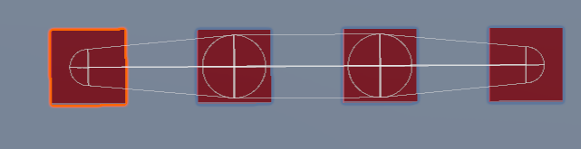

import ReactPlayer from "react-player";

🕒 20 Minute Read

`Last Updated: Sept 20th 2023`

Contributors: [Jellejurre](https://github.com/jellejurre)

---

# Phys Bones & Phys Bones Colliders {#226bf87e1f944244b96d38f2de098a7d}

 In this article, I will go over Phys Bones and Phys Bone Colliders and their settings and how to use them.

---

## Phys Bones {#bd58e69e4049406fb4ec60b1a0f66f64}

Phys Bones allow bones to move on their own, be affected by gravity, be grabbed, and be pushed. They are VRChat’s built-in, more performant version of the old Dynamic Bones package. They have many settings which allow the user to precisely tweak how they want to bones to move and react. I will go over all the settings and show what they do visually (whenever applicable).

Note that all these fields, as well as quite a few fields on the rest of the component, have a `C` next to it. Pressing this allows you to make the fields not constant along the length of the bone. The value of this curve gets multiplied by the value in the field to get the value used per bone. To edit the curve, drag the diamonds around, or double click on the curve to create a new diamond. You can change the angles by changing the outgoing lines from the diamonds. You can select one of the presets at the bottom as well, or move out of Curve mode by pressing the `X` at the right of the field.

 An example is shown below for the Collision Radius field:

The effect of the collision radius field. You can see that the size at the ends is half (0.5) as big as the size in the middle.

An example Curve. In this case used for the Collision Radius field.

---

### Version {#85654f0d400a444d9defe0d3f80db562}

The version switch changes between the older Version 1.0 and the newer Version 1.1.

The differences between the two are as follows:

Version 1.0: 

- Length can’t be affected by motion (stretch & squish)

- Gravity is a force that is affecting the bones, it competes with forces and is affected by Pull. If Gravity is 1, it is just strong gravity.

- Stiffness changes the forces, it competes with pull to keep the bone where it is. If Stiffness is 1, it is just a stiff material.

Version 1.1: 

- Length can be affected by motion (stretch & squish)

- The final position is blended between the down direction and the target direction by a ratio of Gravity. If Gravity is 1, it will always point down (if allowed by Stiffness). It is Absolute.

- The final position is blended between the current position and the target position with a ratio of Stiffness. If Stiffness is 1, it will never move at all. It is Absolute.

---

### Transforms {#8470458605e6483d9cbaa41371f95228}

The Transforms section defines which GameObjects each Phys Bone component acts on.  It deci

Root Transform: The GameObject to apply this Phys Bone to. If left empty, will apply the Phys Bone to the GameObject the Phys Bone is on

Ignore Transforms: a List of children of the Root to ignore in the Phys Bone calculations. Adding a GameObject to this Ignore Transforms list means that it will not be considered as a head or as a tail of any Phys Bone on this component.

Endpoint Position: At all ends of the Phys Bone chain, creates a new “fake” child at this local offset. +Y points along the bone here, so if you just want to extend the bone, put a low number in the y.

Multi Child Type: What to do when there one Phys Bone in the chain has multiple children:

- Ignore: Don’t rotate the bone with multiple children

- First: Rotate the bone as if it has one child: The first one

- Average: Rotate the bone as if it has one child: The average of its children

:::caution

Phys Bones need an end point to work. A single GameObject is not a bone, it is just the head and/or tail of a bone. This is why, if you have a single GameObject, you need an Endpoint position to make it work, since it’s just a head without a tail.

:::

The Transform View

<ReactPlayer width='100%' height='auto'  controls url="https://i.gyazo.com/7c3333a7eb06b12b8a23572fa4fb578a.mp4" />

The Three Multi-Child types. Look at the rotation of the bones with multiple children in particular.

---

### Forces {#40f08b8840a542168c38004376c97139}

The Forces area is where the settings that decide how every bone moves based on factors such as gravity and movement are set. Note that the descriptions here apply to the Version 1.1 settings.

There are two `Integration Types`: `Simplified` and `Advanced`. These change the values available to the user. (Note for the red-green colorblind: Green is the top chain, red is the bottom chain).

Pull: High Pull means the bones move less from the original position (+ gravity), since the velocity is "pulled" towards that direction.

Note how in this example, the movement of the red bone is a lot more dampened than the movement of the green bone.

<ReactPlayer width='100%' height='auto'  controls url="https://i.gyazo.com/506be41fba1ddb4b3a94fc1fd8767c0e.mp4" />

The difference between Pull 0.2 (Green) and Pull 0.4 (Red)

Spring (Only in `Simplified`): High Spring produces "wigglier" bones which don't like to change direction as much, since more of the previous velocity is carried through. 

Note how in this example, the movement of the red bone is more pronounced and wiggles more. While this example doesn’t show it very well, it also makes the bones further down the chain slower to respond to movement higher up the chain. 

<ReactPlayer width='100%' height='auto'  controls url="https://i.gyazo.com/b3b148e9f4e804f9b7beac599ca65c2e.mp4" />

The difference between Spring 0.2 (Green) and Spring 0.9 (Red)

Momentum (Only in `Advanced`): Similar to Spring in that it gives "wigglier" bones, but while Spring makes the bones harder to stop moving, Momentum makes bones harder to move.

Note how in this example, the movement of the red bone is more dampened, but wiggles more than the green bone.

<ReactPlayer width='100%' height='auto'  controls url="https://i.gyazo.com/4f97c68c22eb9f12ef720ee0e4502320.mp4" />

The difference between Momentum 0.2 (Green) and Momentum 0.8 (Red)

Stiffness (Only in `Advanced`): Makes the bones move less overall, as the total movement of the bone is dampened.

Note how the red bone here takes longer to start moving, as well as taking longer to stop moving.

<ReactPlayer width='100%' height='auto'  controls url="https://i.gyazo.com/f790ec7c7067e164ab9accc4fb6a722e.mp4" />

The difference between Stiffness 0.2 (Green) and Stiffness 0.8 (Red) 

Gravity: Makes every bone in the chain’s “Original Position” get pulled down to the floor. Since the actual movement of this is done by the Pull setting, Pull needs to be nonzero for this to have any effect.

Note how the red bone moves less because the movement is orientated closer to its “Original Position”, which in this case is down.

<ReactPlayer width='100%' height='auto'  controls url="https://i.gyazo.com/746604005640f699ce21afcc7a38737d.mp4" />

The difference between Gravity 0.2 (Green) and Gravity 0.5 (Red)

Gravity Falloff: Makes the effect of gravity less strong the closer the bone is to its rest position.

Note how the red bone, when pointed towards the right (its rest position), is under almost no effect from gravity, while when pointing down, it is under almost the full effect of gravity (and similar to green).

<ReactPlayer width='100%' height='auto'  controls url="https://i.gyazo.com/cd7314c4b7b729e521cc8a0418ad13b6.mp4" />

The difference between Gravity Falloff 0 (Green) and Gravity Falloff 1 (Red) 

Immobile: Makes the bone less affected by movement. The `Immobile Type` allows you to choose between only ignoring any movement whatsoever `(All Motion)`, or only movement stemming from moving the avatar `(World (Experimental))`. 

So `All Motion` means that when you play an animation or walk around the playspace, this movement will be dampened. `World (Experimental)` only dampens motion stemming from the avatar moving (so walking with the thumb stick), but not from animation or play space movement. 

Note how the movement of the red bone is dampened compared to the green bone.

<ReactPlayer width='100%' height='auto'  controls url="https://i.gyazo.com/c484941db401e1f4373dd136aec4731a.mp4" />

The difference between Immobile 0 (Green) and Immobile 0.5 (Red)

---

### Limits {#1ba8300c68b942ef8b362aeb931cdccb}

The Limits option allows you to limit the angles at which your Phys Bones can move. There are multiple modes. (Note for the red-green colorblind: Green is left, Red is right)

None: Don’t constrain your phys bone whatsoever.

Angle: Constrain the bones to only be able to move a certain angle away from a set direction. This direction is shown as a cone in the preview, and can be moved around with the pitch, roll and yaw sliders. 

Note how the bones are allowed to move in every direction, but only by a certain amount at max. 

<ReactPlayer width='100%' height='auto'  controls url="https://i.gyazo.com/a0224082b59d1cdad11f5f5128ed3a54.mp4" />

The difference between an Angle Limit of 45 degrees (Green) and 10 degrees (Red)

Hinge: Constrain the bones to only move in one axis by a certain angle. This angle is shown as a semicircle in the preview, and can be moved around with the pitch, roll and yaw sliders.

Note how the bones are only allowed to move left to right (from the viewpoint of the camera), and only by a certain amount at max.

<ReactPlayer width='100%' height='auto'  controls url="https://i.gyazo.com/9be824bdc9fbba7dd0e8511c39bf3ab9.mp4" />

The difference between a Hinge Limit of 45 degrees (Green) and 10 degrees (Red)

Polar: Like Hinge, but you can specify the width of the hinge. This angle is shown as follows in the preview, and, like the rest, the base direction can be moved around with the pitch, roll and yaw sliders.

The preview for a Polar bone

Note how the green bone is allowed to move more freely than the red bone. Note that, according to VRChat, this is the most expensive Limit Type, so if possible one should go with Angle or Hinge.

<ReactPlayer width='100%' height='auto'  controls url="https://i.gyazo.com/fcc17632cd2636c12b0406a49a26cdfb.mp4" />

The difference between a Polar Limit of 45 degrees Roll, 45 degrees Yaw (Green) and 10 degrees Roll, 10 degrees Yaw (Red)

---

### Collision {#72b6889cf05a437d91ee8692cbf08c79}

Collision decides how this Phys Bone collides with Phys Bone colliders. The Radius decides the area of the bone that can collide, while the Colliders list chooses which Phys Bone Colliders can collide with this Phys Bone.

The collision Radius gets built out of one sphere per transform, which get connected by cylinders. Collision Radius is given in Meters, so 1 will be 1 meter (at default scaling).

The Allow Collision dropdown allows you to select whose finger and hand colliders get added to the collision list:

- True: Everyone’s finger and hand colliders get added to the collision list

- False: Nobody’s finger and hand colliders get added to the collision list

- Other: You can decide whose finger and hand colliders get added to the collision list with two checkboxes:-
	- Self: Do the local player’s finger and hand colliders get added to the collision list
	- Others: Do everybody else’s finger and hand colliders get added to the collision list

Note: This means that colliders with their Allow Collision set to false can still collide with the current Phys Bone Colliders in the Collision list.

Colliders: The list of VRC Phys Bone colliders that the bone can collide with. Will be expanded with the finger and hand colliders set in the VRC Avatar Descriptor of the people set in the Allow Collision dropdown.

The collision boxes of phys bones with Collision Radius 0.5 (Green, Top) and Collision Radius 1 (Red, Bottom)

---

### Stretch And Squish {#98821aaaa7c143dea07ef62ab33c798d}

Phys bones of Version 1.1 allow for motion to Stretch (elongate) and Squish (shorten) physbones.

Stretch motion decides which portion of the bone’s movement gets used in the Stretch and Squish calculations. 1.0 means all movement gets considered, 0.0 means no movement gets considered. Note that collision always applies Stretch and Squish, no matter what this is set to.

Note how the distance between the green bones stays mostly similar, while the red bones really get dragged away from each other.

Max Stretch and Max Squish are limits on the Stretch and Squish, as a multiple of the original length of the bone.

<ReactPlayer width='100%' height='auto'  controls url="https://i.gyazo.com/ba0960b2eaf0d4b271e42226767418a9.mp4" />

The difference between 0.2 Stretch Motion (Green, Top) and 0.8 Stretch Motion (Red, Bottom)

---

### Grab and Pose {#e67ee0512ff54d9d9164dd9a6b2b9f50}

Phys Bones can be grabbed by squeezing the Grip Button, and then subsequently posed by squeezing the Trigger and then releasing at the posed position. Grabbed Phys Bones move back to their basic position when released, while Posed Phys Bones stay in their posed position. In the circle menu, you can select `Quick Action` →  `Release Poses` to release all Posed Phys Bones.

Allow Grabbing: Decides whether you and/or others can grab the phys bone

Allow Posing: Decides whether you and/or others can pose the phys bone

Grab Movement: Decides how much the Phys Bone should move to the hand. 1.0 means snapping instantly to the new position, 0.0 means to use the Forces values to move there.

Snap to Hand: Decides whether the Phys Bone should snap to the middle of the hand Collider or stay at the grabbed offset.

---

### Options {#678ab14a68bb42dc8c72de2d5d309190}

Parameter: Phys Bones can set parameters in the Playable Layers. The name in this field decides the name of the parameter being set. For example: having `MyBone` in this field will set the parameter `MyBone_IsGrabbed` in your Playable Layers. The parameters that will be set are as follows:

- `[name]_IsGrabbed`: Whether or not the parameter is currently grabbed. Bool
- `[name]_IsPosed`: Whether or not the Phys Bone is currently posed. Bool
- `[name]_Angle`: The maximum angle value that any Phys Bone in the chain is making from its default position. Float. 0.0 is 0 degrees, 1.0 is 180 degrees.
- `[name]_Stretch`: The maximum Stretch value any Phys Bone in this chain. Float. 0.0 is the default length or less, 1.0 is the Max Stretch as set in the options.
- `[name]_Squish`: The maximum Squish value any Phys Bone in this chain. Float. 0.0 is the default length or more, 1.0 is a length of 0.

:::tip

Note that the parameter type can be mismatched using the same mechanics as [Untitled](https://www.notion.so/2fc0f34adabd4f4eb047867005e168df)

:::

:::tip

Note that you can choose to put the Parameters you use in the Playable Layers if you want more consistency over the values that each user calculates locally, but this is generally not necessary

:::

Is Animated: Whether or not this Phys Bone has any transforms that are animated. Enabling this value is, according to VRChat, worse for performance, but in my Benchmarks at [Untitled](https://www.notion.so/f5cd7b22384c4afab6c3a1549351fa64) I was unable to notice a difference

Reset When Disabled: Whether or not the transforms affected by this Phys Bone should reset back to their default positions when this Phys Bone is disabled

---

### Important Notes {#279a2c2473e64b4bb302c6fac6121455}

You can animate phys bone properties by changing the values, disabling them, and re-enabling them a few frames later. It seems 12 frames is enough to consistently re-toggle the component. This is not a supported use case and can break at any time

You should never put phys bones on Humanoid bones. It can and will break your avatar’s locomotion

---

## Phys Bone Colliders {#b4899a875cf24c57b87c2116bfe3b1b0}

Phys Bone Colliders are colliders for Phys Bones, so for example if you didn’t want your hair to clip through the chest, you would add a Phys Bone Collider to the chest and then add that collider to the collider list in the hair Phys Bones. Phys Bone Colliders only collide with Phys Bones which have that specific Phys Bone Collider in their Phys Bone Collider list

The Fingers and Hands on the Colliders section of the Avatar Descriptor get turned into Phys Bone Colliders that get added to all Phys Bones, so you can always use your fingers to interact with any Phys Bone that has collision enabled

Root Transform: The GameObject to apply this Phys Bone to. If left empty, will apply the Phys Bone to the GameObject the Phys Bone is on

Shape Type:

- Sphere: Is a Sphere, defined by a Radius, in Meters

- Capsule: Is a Capsule (two half spheres and a cylinder), defined by a Height (the height of the cylinder, in Meters) and a Radius (the radius of both the half spheres and the cylinder, in Meters)

- Plane: Is a 1mx1m plane on the xz axis

Note that all of these shapes are affected by the Position, Rotation and Scale of the transform they are on, as well as having a global Position and Rotation field themselves as well

Inside Bounds: Whether or not the Phys Bone Collider should force the colliding Phys Bone inwards towards its center, or outwards towards its surface. Only available on Sphere and Capsule colliders

Bones As Spheres: Whether or not this Phys Bone Collider should ignore the cylinders connecting Phys Bones and should only consider the spheres on the Phys Bone bones themselves.

---

[Untitled](https://www.notion.so/1157566ec16b440ba06c2c4f7a0ac7b1) 

