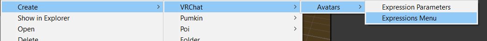
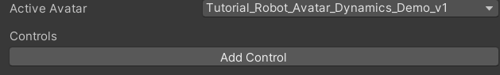

Contributors: [Jellejurre](https://jellejurre.dev/), [JustSleightly](https://vrc.sleightly.dev/)

# Expressions Menu and Parameters {#ca4a35bdba0e479ba060d4b860675ac3}

## VRC Expression Parameters {#3f9be84365e44b13b94310cc54646f29}

A VRC Expression Parameter List is an Asset containing a list of parameters, consisting of a name, a type, a default value, whether or not it’s saved, and whether or not it’s synced. It can be created by (under Assets in the Project window) `Right Click` → `Create` → `VRChat` → `Avatars` → `Expression Parameters`.

 <GreyItalicText>How to create a VRC EXpression Parameter List</GreyItalicText>

This list is used by VRChat to animate parameters in your Playable Layers, and its values can be edited by in multiple ways:

- The VRC Expression Menu (circle menu)
- A VRC Contact Receiver’s parameter
- A VRC Parameter Driver

Every parameter on the VRC Expression Parameter list gets its value sent to every Playable Layer in the VRC Avatar Descriptor.

For example: 

If you have a VRC Expression Parameter called “Hat Toggle” and a parameter in your FX Controller called “Hat Toggle” (exact same spelling), then whenever the Expression Parameter gets enabled, so does the FX Controller parameter.

:::tip

The Expression Parameter and the Controller Parameter don’t have to be of the same type. More information on this can be found on the [Expression Parameter Mismatching](/docs/Other/Parameter-Mismatching) page.

:::

To Add a parameter, you can press the `Add` button at the top of the VRC Expression Parameter List inspector. To move a parameter up or down, you can click on the parameter to select it and make it light gray, and then press the `Up` or `Down` buttons. To delete a parameter, you can select it and press the `Delete` button.

The `Clear Parameters` button clears the parameters, and the `Default Parameters` button resets it to the defaults.

 <GreyItalicText>The Default VRC Expression Parameters. These are only needed if you’re using the default Action controller (for VRCEmote) or the default FX controller (for the other two).</GreyItalicText>

---

### Settings {#171005c78273492b99e3919f6418ad56}

A VRC Expression Parameter has a few settings:

- **Name**: This name determines which parameters get set in the Playable Layers. Only parameters with the exact same name in the Playable Layer Controllers get set. This also is the name that should be entered in the VRC Contact Receiver or VRC Phys Bone `Parameter` fields.
- **Type**:
	- `Int`: whole numbers, can technically be any whole number, but only numbers 0 to 255 are synced.
	- `Float`: any number, can technically be any number, but only multiples of 1/127 between -1 and 1 are synced (so -1, -126/127, … 126/127, 1).
	- `Bool`: True or False
- **Default**:
	- The default value which gets used whenever you reset your avatar (or when you restart/rejoin a world with `Saved` disabled).
- **Saved**:
	- Whether or not this value gets saved between world/sessions, or reset to the default value.
- **Synced**:
	- Whether or not this value gets synced to remote players. This should generally be true, unless you’re relying on remote Contact, Phys Bone, or Parameter Driver behaviour to set the values for you.
	- Only synced values are counted towards bits being used, but note that unsynced values aren’t synced to other players. Syncing a `Float` or an `Int` takes 8 bits, while syncing a `Bool` takes 1.
	- You can only sync up to 256 bits (128 bits on older SDKs). Older SDKs also didn’t have this Synced value.

 <GreyItalicText>An example VRC Expression Parameter List</GreyItalicText>

---

## VRC Expression Menu {#2c9f6ab533b346fcbdf7dcc1051bc4b1}

A VRC Expression Menu is an Asset containing the layout for one Menu (Circle) of your Circle Hand Menu. A Menu can contain up to eight “Controls”, and has a selected Active Avatar. This avatar is used to get and check the VRC Expression Parameters from. 

There are six types of Controls:

 <GreyItalicText>How to create a VRC Expression Menu</GreyItalicText>

- **Button**: Turns the parameter in the `Parameter` field to True (Bool) or the value in the `Value` field (Float or Int) for as long as the user presses the button, and back to False (Bool) or 0 (Float or Int) when the user lets go of the button. 
If you give it a short press, it stays enabled for at least 0.2 seconds.

	You would use this if you have a value which you wanna enable only for a quick moment, which realistically doesn’t happen often.

 <GreyItalicText>A Default VRC Expression Menu. It has 0 Controls and has my current avatar selected.</GreyItalicText>

---

- **Toggle**: Turns the parameter in the `Parameter` field to True (Bool) or the value in the `Value` field (Float or Int) when enabled, and to False (Bool) or 0 when disabled. Pressing the button switched between enabled and disabled.

	This is the most often used Control, as they are used for on/off toggles.

---

- **Sub Menu**: Leaves the current Menu (Circle) and goes to the Menu (Circle) in the `Sub Menu` field. 
If a parameter is entered in the `Parameter` field, it behaves like a Toggle, but stays enabled while the user is in the Sub Menu, and disabled when they’re outside of it. In the Sub Menu, the user can press the `Back` button to go back to this menu.

	This is used for organization, and when you want more than 8 Controls. If you wanna use 9 Controls in total, you could put 7 in your top level Menu (Circle), and then make a Sub Menu Control which points at another Menu (Circle) with the last 2 Controls.

---

- **Two Axis Puppet**: This is one of the more niche controls, it sets two Float parameters based on four buttons. If the stick is pushed all the way up, the `Parameter Vertical` parameter is set to 1, if the stick is pushed all the way down, the `Parameter Vertical` is set to -1. If it is pushed halfway up, it is set to 0.5, etc. The same happens for Left-Right and the `Parameter Horizonal` field. You can set labels and icons for every direction in the respective fields.
The `Parameter` and (when using a Float/Int) `Value` field act like a Toggle based on the puppet being open.
This Control is rarely used. It can be useful for stuff like controlling a moving tail, or a flying drone, but this is not something you’ll see happen often.

---

- **Four Axis Puppet**: This is also one of the more niche controls. It acts like a Two Axis puppet, but instead of having two parameters which are set to between -1 and 1, there are four parameter which are set to between 0 and 1.
The `Parameter` and (when using a Float/Int) `Value` field act like a Toggle based on the puppet being open.
This Control is also rarely used, with similar uses to the Two Axis Puppet.

 <GreyItalicText>A Two/Four Axis Puppet</GreyItalicText>

---

- **Radial Puppet**: This is one of the most popular Controls. It has a `Parameter Rotation` field which sets a parameter based on the rotation of the puppet. This will be a value between 0 and 1 for Floats, and is saved when you close the Control with the trigger. 
The `Parameter` and (when using a Float/Int) `Value` field act like a Toggle based on the puppet being open.
This Control is the second most popular Control, as it is used for slider settings (like hue or emission sliders) and simple setups for mutually exclusive toggles like a set of tops or pants.

 <GreyItalicText>A Radial Puppet</GreyItalicText>

---
<RightAlignedText>Last Updated: 31 March 2024 08:54:00</RightAlignedText>