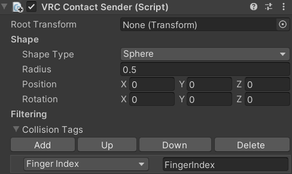

Contributors: [Jellejurre](https://jellejurre.dev/), [JustSleightly](https://vrc.sleightly.dev/)

# VRChat Avatars 3.0 {#7ef15a6c929940559fbb638e93c8a213}

VRChat avatars are 3D models that get uploaded through the Unity engine. In this Unity engine, VRChat gives us a set of tools which we can use to add functionality to our avatar, such as: toggles, facial expressions, movement animations, flowing hair, nose boop detectors, etc. This suite of tools is called the Avatar 3.0 system. In this article we will give a high level overview of what every component of the Avatar 3.0 system does, and what it can be used for.

---

## The Avatar Descriptor {#72bce80819ea47bba105e498860f7256}

The Avatar Descriptor is the place where you can set up the functionality of your avatar, including: 

- Where the viewpoint is
- How the avatar’s face moves when talking
- How the avatar’s eyes move
- How the avatar looks when walking/emoting
- How the avatar’s toggles, gestures and facial expressions work
- The contents of the avatar’s circle menu, and what they do
- The colliders that are used for touching stuff

A more complete guide on the contents of the Avatar Descriptor and what it does can be found on the [The Avatar Descriptor](/docs/Avatars/Avatar-Descriptor) page.

 <GreyItalicText>An example Avatar Descriptor</GreyItalicText>

---

## Contact Senders/Receivers {#b326429f38894774adaea38fb9398e7d}

Contact Receivers detect Contact Senders that are nearby them.

This works across avatars, so they are the primary method of detecting other player interactions (think headpat or boop detection)

Receivers can only detect senders that have the pre-set tags, so for example you can say that a nose boop detection can only get triggered by index fingers, and not heads. 

The Colliders section of the VRC Avatar Descriptor contains a list of default VRC Contact Senders and where they will be placed.

More information on Contact Senders and Receivers can be found on the [Contact Receivers/Senders](/docs/Avatars/Contacts) page.

 <GreyItalicText>An example VRC Contact Sender</GreyItalicText>

 <GreyItalicText>An example VRC Contact Receiver</GreyItalicText>

---

## Phys Bones & Phys Bone Colliders {#b3a48e7dd4d54c93be120dfb1432e3c3}

Phys Bones allow bones to move on their own, be affected by gravity, be grabbed, and be pushed. They are VRChat’s built-in, more performant version of the old Dynamic Bones package. They have many settings which allow the user to precisely tweak how they want to bones to move and react. 

Phys Bone Colliders are colliders for Phys Bones, so for example if you didn’t want your hair to clip through the chest, you would add a Phys Bone Collider to the chest and then add that collider to the collider list in the hair Phys Bones. 

The Fingers and Hands on the Colliders section of the Avatar Descriptor get turned into Phys Bone Colliders that get added to all Phys Bones, so you can always use your fingers to interact with any Phys Bone that has collision enabled.

More information on Phys Bones and Phys Bone Colliders can be found on the [Phys Bones](/docs/Avatars/PhysBones) page. 

---

## Stations {#e5720d5cd2eb411aa615246530f30208}

Stations (also knows as “seats”) allow other users to sit on certain places of the avatar and move with you. They require a Collider on the same object as the Station (which will be the area the user can click on).

Once another user is sitting in your Station, you can use an Animator Controller to change their avatar. By default VRChat will play a default sitting animation when seated in a station. Players can (by default) leave a station by moving while inside the station.

More information in Stations can be found on the [Stations](/docs/Other/Stations) page.

---

## Head Chop {#b2325e3008824574acfcf72079474ed8}

Head Chop is a new component (added in March of 2023) that allows player to selectively scale certain parts of their head up and down.

VRChat renders three clones of the local avatar:

- The mirror clone, with its head scaled to full, which is what you see in the mirror
- The shadow clone, with its head scaled to full, which is what casts shadows
- The local clone, with its head scaled down, which is what you see from first person. The head is scaled down so you don’t see your own hair or glasses or anything in front of your eyes.

The Head Chop component allows creators to selectively toggle on and off what is being hidden in the local clone in game.

More information can be found on the [Head Chop](/docs/Avatars/HeadChop) page.

---

## VRC State Behaviours {#ab8c9063caa84fa58b9905f5c4b832ff}

VRC State Behaviours (for example: Parameter Drivers, Tracking Control) are tools that can change certain settings on your Avatar in your Playable Layers Animator Controllers. They can be quite advanced and require basic knowledge of Animator Controllers to use. More information on them can be found on the [VRC State Behaviours](/docs/Avatars/State-Behaviours) page. 

---
<RightAlignedText>Last Updated: 31 March 2024 09:37:00</RightAlignedText>