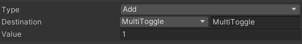
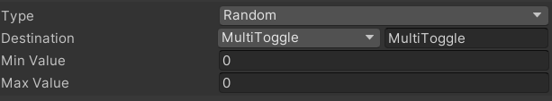
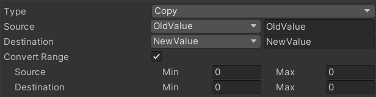
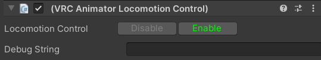

Contributors: [Jellejurre](https://jellejurre.dev/), [JustSleightly](https://vrc.sleightly.dev/)

# VRC State Behaviours {#30fe2e9577d54b22926c6f24fed3f698}

The VRChat SDK includes a few State Behaviours. State Behaviours are small Scripts which you can put on Animator States to perform an action once the Animator State has been entered. They can be added to a state by clicking the `Add Behaviour` button in the State’s Inspector and clicking on the right one, and they can be removed by, clicking `Right Click` → `Remove` on the name of the State Behaviour.

:::caution

Contrary to what Unity’s documentation says: State Behaviours still run even when the layer’s weight is set to 0.

:::

Note: every State Behaviour has a `Debug String` field. The string put in this field gets logged to the Logs whenever this State Behaviour runs. I won’t elaborate on these in the specific State Behaviour sections.

---

## VRC Avatar Parameter Driver {#401d5aa881504f9698ffad38f0a057e2}

This State Behaviour is the most popular State Behaviour for creating systems. It allows setting VRC Expression Parameters and Playable Layer Animator Controller Parameters. 

You can select multiple operations for this State Behaviour to take, and it will perform them top to bottom. 

The `Local Only` toggle lets the Parameter Driver only run locally.

The `Add`, `Up`, `Down` and `Delete` buttons can be used to add, move and delete operations

This State Behaviour gets used for all sorts of things, mostly Systems that require changing the parameters as they appear in the Expression Menu, and systems that need to Count things (like gun ammo).

:::caution

Synced Parameters are clamped between their Sync bounds. This is [0, 255] for int and [-1, 1] for float

:::

:::caution

You can’t use this to copy from and/or change [Built-In VRC Parameters](https://www.notion.so/f00269fb10714776bdfd97d3c28c7353) and [Animated Animator Parameters (AAP)](/docs/Other/AAPs).

:::

Note that for all operations, [Expression Parameter Mismatching](/docs/Other/Parameter-Mismatching) applies, based on the type in the controller, and the input type being a float.

 <GreyItalicText>A VRC Avatar Parameter Driver State Behaviour</GreyItalicText>

### The Set operation {#96f1be6c813941c4af74f5c9c5375dc3}

The **Set** operation sets a value across all Playable Layers and in the Expression Parameters List.

The **Destination** field is the parameter that will be set, and the **Value** field is the value that will be used. 

 <GreyItalicText>A VRC Avatar Parameter Driver Set Operation</GreyItalicText>

### The Add operation {#d8467d2e5e274ec790866077c61669e4}

The **Add** operation adds a set number to a value across all Playable Layers and in the Expression Parameters List.

The **Destination** field is the parameter that will be set, and the **Value** field is the value that will be used. 

This parameter is best applied locally, and the resulting value synced over the network.

 <GreyItalicText>A VRC Avatar Parameter Driver Add Operation</GreyItalicText>

### The Random operation {#353167753d114cad89623836361d7040}

The **Random** operation sets a value to a random number between the Min Value and the Max Value. Note that these values are inclusive, so [0, 6] can roll both a 0 and a 6. Across all playable layers, the rolled value will be the same.

The **Destination** field is the parameter that will be set, and the **Min** and **Max** **Value** fields are the value that will be used for the randomization. 

This parameter is best applied locally, with the resulting value synced over the network.

 <GreyItalicText>A VRC Avatar Parameter Driver Random Operation</GreyItalicText>

### The Copy operation {#48791a660b444283ab638b9d0953eb20}

The Copy operation allows you to copy a value to another value across all Playable Layers and in the Expression Parameters List, including remapping.

This is the most useful Parameter Driver operation to use [Expression Parameter Mismatching](/docs/Other/Parameter-Mismatching) with, as it allows us to map a value from one type to another. 

The **Source** and **Destination** are the source and target parameters that will be used.

If **Convert Range** is enabled, the source parameter will be mapped from the source range to the destination range.

For example, you are copying a Float to an Int with value `2.1`, source range `[0, 10]` and target range `[0, 20]`.

Then this value will be remapped from `[0, 10]` to `[0, 20]`, giving us a value of `4.2`. This value will be converted to an Int, which means chopping off the decimal part, giving us a final value of `4`.

 <GreyItalicText>A VRC Avatar Parameter Driver Copy Operation</GreyItalicText>

---

## VRC Animator Tracking Control {#637521443d8245cb9e233bd50f036fab}

This State Behaviour gets used to force certain body parts to respect the Animator instead of being Simulated or following IK.

If a part is set to Tracking, it will follow IK, if it is set to Animation, it will follow the Animator.

Some quirks to this: 

- Setting Eyes & Eyelids to Animation will disable Eyelid Blinking
- Setting Mouth & Jaw to Animation will disable Visemes and freeze the current Viseme parameter
- If a per-platform defines list of parts are set to Animation, IK will stop sending overall to save bandwidth
	- Desktop: Head, Left Hand, Right Hand
	- 3pt Tracking: Head, Left Hand, Right Hand
	- 6pt / FBT Tracking: Head, Left Hand, Right Hand, Hip, Left Foot, Right Foot

 <GreyItalicText>A VRC Animator Tracking Control State Behaviour</GreyItalicText>

This State Behaviour gets used for Freezing the body during Emotes and AFK, freezing parts of the body for Sitting (to be specific, freezing almost the whole body until pose control kicks in, and then releasing upper body), and freezing parts during Locomotion (for example Jumping).

---

## VRC Animator Layer Control {#5d239c473ff64f679a4d01ee9b784abb}

This State Behaviour is used to set the Layer Weight of specific Layers in one of your Playable Animator Controllers. 

Fields:

- **Playable**: The Playable whose Layers are affected. Options: Action, FX, Gesture, Additive
- **Layer**: The layer index to affect. Starts counting at 0, though you can’t change the 0th (base) layer
- **Goal Weight**: The final goal weight to be blended to once the Animator Layer Control is done
- **Blend Duration**: How long it takes to blend the selected Layer to the selected Goal Weight

 <GreyItalicText>A VRC Animator Layer Control State Behavour</GreyItalicText>

:::note

If this state is exited before the blending is done, the target Layer gets set to the target Weight instantly before leaving 

:::

:::note

This State Behaviour controls the weight of a single Animator Layer on a selected Playable Layer (FX, Action, Gesture, etc), while the VRC Playable Layer Control controls the weight of a whole Playable Layer

:::

This can be used to, for example, blend the second layer of the FX Layer to weight 0 over the course of 1 second to stop it from affecting the Avatar.

This State Behaviour used to be used to send data from Sub Animators to the main Animator, but generally Parameter Drivers are used for that. 

---

## VRC Animator Locomotion Control {#f1df279e19f242d49d31b0875abe7c9a}

This State Behaviour is used to enable/disable Locomotion.

In **desktop**, this means no more walking, and only looking up and down

In **VR**, this means no moving around/rotating with the thumbstick and no more lower body movement

In **FBT**, this means no moving around/rotating with the thumbstick

Fields:

- **Locomotion Control**: Whether entering this state should enable or disable locomotion control

 <GreyItalicText>A VRC Animator Locomotion Control State Behaviour</GreyItalicText>

This state behaviour is often used to immobilize your avatar, such as for dancers who want to prevent accidental thumbstick movement on stage, or locking systems like Dreadrith’s Password Creator.

---

## VRC Animator Temporary Pose Space {#fcfa6402f9ec45d18eb3ae22cbcbf169}

This State Behaviour is a bit more advanced, but it is used to set the player’s head location to world space based on the location of the head bone.

To be more clear: There is an offset from the head bone that is figured out through the T Pose controller and the View Position in the Avatar descriptor. After the given delay, the location of the head bone is taken, this offset is applied, and the view point is stuck in place at that specific point until another Temporary Pose Space is used to release it.

Fields:

- **Pose Space**: Whether to Enter pose space (freeze the view) or Exit pose space (re-attach the view)
- **Fixed Delay**: Whether or not the Delay is in seconds or in % of the playing animation
- **Delay Time**: If Fixed Delay is enabled: delay in seconds until the view is frozen. If Fixed Delay is disabled: delay in fraction (not %!) of the state’s animation until the view is frozen

:::caution

If the state is exited before the Fixed Delay has passed, the Pose Space is not changed

:::

 <GreyItalicText>A VRC Animator Temporary Pose Space State Behaviour</GreyItalicText>

This State Behaviour is often used during emotes, sitting, or AFK, when you want to freeze the view to a certain spot. 

---

## VRC Playable Layer Control {#9bcc9107ab634f74b1e63c3fbdd3cdc8}

This State Behaviour is used to control the weight of entire Playable Layers.

For example, the Action Layer has its weight set to 0 by default (so it doesn’t animate anything), and it blends its own weight up to 1 before doing any emotes, and then blending its weight down to 0 again. 

 <GreyItalicText>A VRC Playable Layer Tracking Control State Behaviour</GreyItalicText>

:::note

This State Behaviour controls the weight of the entire Playable Layer (FX, Action, Gesture, etc), while the VRC Animator Layer Control controls a single Animator Layer on the selected Playable Layer

:::

:::note

If this state is exited before the blending is done, the target Layer gets set to the target Weight instantly before leaving 

:::

Fields:

- **Playable**: The Playable whose Layers are affected. Options: Action, FX, Gesture, Additive
- **Goal Weight**: The final goal weight to be blended to once the Animator Layer Control is done
- **Blend Duration**: How long it takes to blend the selected Layer to the selected Goal Weight

This State Behaviour is typically used to enable and disable the action layer during emotes/afk animations.

---

### VRC Animator Play Audio {#0f5d15bf91b8435298846d1cbdf54d0e}

This is the State Behaviour with the most options, but overall it’s pretty straightforward.

It can play any number of Audio Clips on a single Audio Source. Do note that many Audio Clips quickly make your avatar expand in size, so use carefully.

 <GreyItalicText>A VRC Animator Play Audio State Behaviour</GreyItalicText>

Fields:

- **Source Path**: The path from the root of the avatar to the target Audio Source. Can either be set manually, or by dragging an Audio Source into the Audio Source field.
- **Playback Order**: How the next clip is decided. Is one of the following:
	- Random: Next clip is random, can be the same clip twice.
	- Unique Random: Next clip is random, but can not be the same clip twice.
	- Roundabout: Next clip is the next clip in line, goes back to start once all clips have been played.
	- Parameter: Next clip is determined by an Int parameter. If the Int parameter is out of range, no clip is played.
- **Random Volume**: On State Enter, can be used to set the Audio Source to a random volume (or a set one by having the min and max be the same). Can either be `Always Applied`, `Applied if Stopped`, or `Never Applied`, depending on the setting on the right.
- **Random Pitch**: On State Enter, can be used to set the Audio Source to a random pitch (or a set one by having the min and max be the same). Can either be `Always Applied`, `Applied if Stopped`, or `Never Applied`, depending on the setting on the right.
- **Random Volume**: On State Enter, can be used to set the Audio Source to a random volume (or a set one by having the min and max be the same). Can either be `Always Applied`, `Applied if Stopped`, or `Never Applied`, depending on the setting on the right.
- **Loop**: On State Enter, can be used to set the Audio Source to loop or not. Can either be `Always Applied`, `Applied if Stopped`, or `Never Applied`, depending on the setting on the right.
- **Stop On Enter**: Whether or not the current playing Audio Clip should be stopped upon entering the state.
- **Start On Enter**: Whether or not the current selected Audio Clip should be started after the set delay in the `Play On Enter Delay` field after entering the state.
- **Stop On Exit**: Whether or not the current playing Audio Clip should be stopped upon exiting the state.
- **Start On Exit**: Whether or not the current selected Audio Clip should be started after exiting the state.

---
<RightAlignedText>Last Updated: 18 June 2024 16:10:00</RightAlignedText>