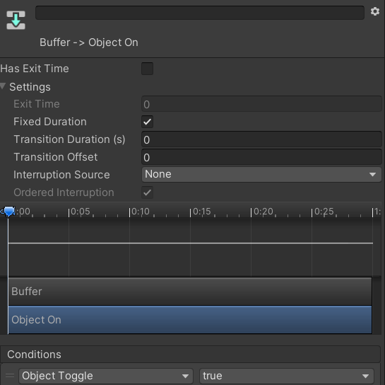

Contributors: [Jellejurre](https://jellejurre.dev/), [JustSleightly](https://vrc.sleightly.dev/)

# Toggles {#e2db7f1406a04dde8b1f2f6dfde35790}

Toggles are a way to use your Hand (Circle) Menu to enable/disable certain objects on your avatar.

This article will assume you know how to record certain values into Animation Clips. If you don’t know this, a step by step guide is given in the [Animation Clips](/docs/Unity-Animations/Animation-Clips) article.

Notes: 

To create a new Layer, press the + at the top of the `Layers` view, give it a name, and change the Weight to 1 by clicking on the cog and dragging the slider to 1.

To create a new Animator State (block), you can press `Right Click` → `Create State` → `Empty`.

To create a new Transition you can `Right Click` the source (first) state, press `New Transition`, and then click the target (second) state.

---

## Simple Toggles {#5f6d6518cfdb427892e35dc82405d609}

The simplest toggle that achieves all functionality we want is the one on the right. In the Buffer state, we have a Buffer animation, which is an animation with two keyframes, animating a value that doesn’t exist, like the example on the right. It will require a Bool parameter with the same name in both your Animator Controller and your Expression Parameter List, and having a Toggle Control in one of your Expression Menus that toggles this parameter.

In the Object On state, we have an animation with two keyframes, both enabling the object, and in the Object Off state we have an animation with two keyframes, both disabling the object.

 <GreyItalicText>The most basic toggle</GreyItalicText>

The Buffer state is there so that if your toggle is enabled on upload, it doesn’t disable for one frame to get to the enable state or vice versa. The Buffer animation is there to make the setup Write Defaults agnostic (so both Write Defaults can be used).

 <GreyItalicText>An example buffer animation</GreyItalicText>

The Transitions going to Object On both look like the Object On transitions, and the Transitions going to Object Off both look like the Object Off transitions. 

Note that this assumes that having the Controller Parameter enabled means the object is on. If this is inverted in your setup, you will have to reverse the True and False values.

Explanations:

- We want exit time disabled since otherwise your transitions will take longer to start (and therefore take longer)
	- Note: This is different with Dissolves, since with them you want to wait until the whole state is done playing. With them you would have exit time enabled and set to 1.
- We want Transition Duration to be set to 0 because otherwise your transitions will needlessly take longer

 <GreyItalicText>The Object On transitions</GreyItalicText>

 <GreyItalicText>The Object Off transitions</GreyItalicText>

---
<RightAlignedText>Last Updated: 31 March 2024 08:54:00</RightAlignedText>