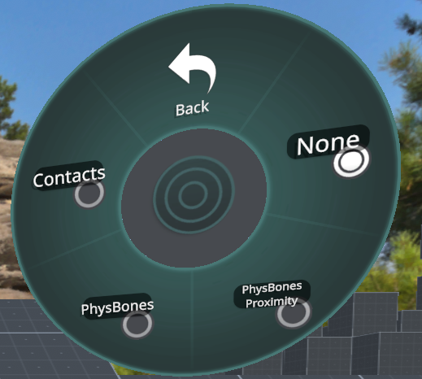
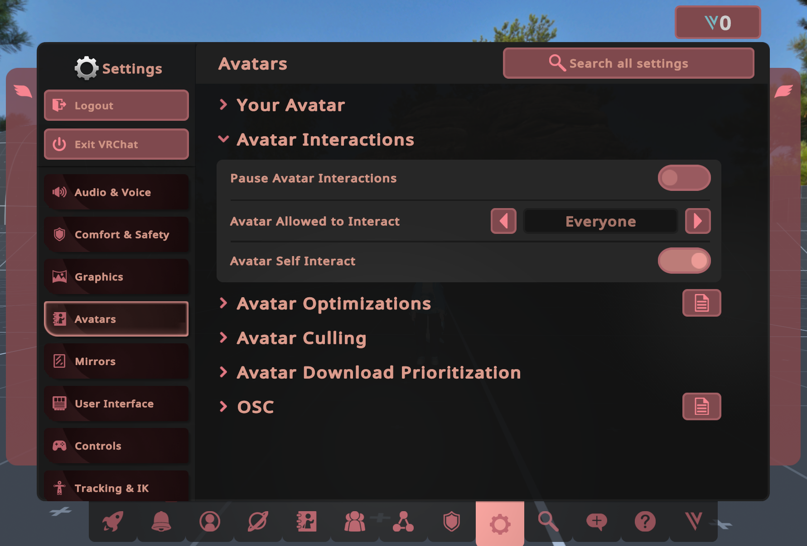

Contributors: [Jellejurre](https://jellejurre.dev/)

import ReactPlayer from "react-player";

# Troubleshooting 3.0 {#b2d6d5d2dc45404d89f1739b11f42659}

Avatars 3.0 is a complex pipeline where things can go wrong at any step. It’s good to keep a mental map of [Understanding Avatars 3.0](/docs/Avatars/Understanding-Avatars-3-0) to help isolate issues.

Two useful tools for this are [Avatar 3.0 Emulator](https://github.com/lyuma/Av3Emulator) and [Gesture Manager](https://github.com/BlackStartx/VRC-Gesture-Manager), both of which are available as a Curated package in the VCC.

---

## In the Unity Editor (Outside of Play Mode) {#f88cb0942b914b29a3b1aaf059b7e943}

### Expressions Menu {#aa1487fa99a74c309aee37c93efd85e6}

The first step is the Expressions Menu. This is used to set an Expression Parameter to a certain value.

Check if:

1. The parameter in the Control is the parameter you want to change.
2. This Expressions Menu is the Expressions Menu used in your avatar. This can be done by going to your Avatar Descriptor, double-clicking the Expressions Menu field under Expressions, and navigating to the Menu you want to troubleshoot.

 <GreyItalicText>An example toggle changing the boolParameter parameter.</GreyItalicText>

 <GreyItalicText>An example radial puppet changing the floatParameter parameter. Note that the Parameter field is empty, and the Parameter Rotation field has a value.</GreyItalicText>

### Expression Parameters {#95574cc8477c4adf9b56242bbaaaa368}

The Expressions Menu sets Expression Parameters. 

Check if:

1. The Expression Parameter you’re changing has the same name as the Controller Parameter in your FX Controller.
	1. It needs to match 100%, from case-sensitivity to spaces/symbols.
2. The Expression Parameter is set to Synced. If not, it will not sync over the network, and other players will not see this toggle.
	1. This is enabled the majority of the time, but some systems may intentionally leave this disabled for complex reasons.
3. The default value is the default value you want and expect.

 <GreyItalicText>An example set of Expression Parameters. Note that they are both set to Synced.</GreyItalicText>

### Controller Parameters {#b206dd11f45b4f2693a319366c7108c1}

Expression Parameters set Controller Parameters on all the Playable Layers.

Check if:

1. The controller you want to use is in the correct field: your FX controller should go in the FX field of the Playable Layers.
	1. Note that the Animator’s Controller field does nothing in-game or with Emulators.
2. The Controller Parameter has the same name as the Expression Parameter you’re changing.
3. The Controller Parameter has the right type.
	1. To see if a parameter is an int or a float, try entering 0.5. If it swaps back to 0, you have an int and will need to remake the parameter.

 <GreyItalicText>An example set of Controller Parameters. Note that they have the same name as the Expression Parameters.</GreyItalicText>

### Controller Layers {#f0f0dd02f6b4461b8ddbcc3ce445de6f}

Only one thing to check here: _Is the layer weight of my Animator Layer set to 1?_

This is indicated in the line below the name of the Layer. Light Grey means 1, Dark Grey means 0.

This can be changed by clicking the gear icon and setting the value to 1 by moving the slider.

 <GreyItalicText>An example Layer. Note the Weight is set to 1, which is indicated by the Light Grey line under the Layer Name.</GreyItalicText>

### Controller States/Transitions {#3d0068d17991478487a2e28f46482e1a}

In your layer, one State is being played, and Transitions allow you to move between those states.

Make sure that the Transitions between the States have the right Conditions and Parameters:

1. Check if the Transition Conditions are set correctly.
	1. Check if each transition has the right parameter, looking for the right value
2. Check if the `Transition Duration` is 0 (unless you want it to be longer).
3. Check if `Has Exit Time` is disabled (unless you want exit time).
4. Check if the Animation Clips are in the correct states you want.
5. The right state is marked as the Default (orange state, Can be changed by right clicking a state and clicking `Set as Layer Default State`.

 <GreyItalicText>An example Animator Layer. You can see the Transition</GreyItalicText>

### Animations {#429d079a33b8487cace718a6a643c04c}

In a State, an Animation Clip is played.

To test this, you can drag the Animation onto your avatar. This will either generate a new Animator Controller and put it in the Animator’s Controller field, or use the existing one, and add this Animation to the top Animator Layer.

This is useful, because to preview an Animation, the Animation needs to be in the Animator’s Controller.

Now, you can open the Animation window by going to Window → Animation → Animation at the top of your screen.

 <GreyItalicText>An example animation. If this says Missing in yellow text, you will need to re-record the changes.</GreyItalicText>

After doing this and clicking your avatar in the hierarchy, you will see the Preview button turn from Grey to White, and an Animation will appear in the dropdown.

Click this dropdown and choose your Animation to debug.

From here, you can click `Preview` to see what the Animation will do, and click the red circle to record new changes.

Make sure to click `Preview` again to go out of preview mode once you’re done.

---

## In VRChat {#f9691a0eff8d40f4832b3efdd7836a53}

### Debug Menu {#6d329e17f11f4de9ac27dbd22318a719}

You can troubleshoot your animations in VRChat by going to Options → Avatar → Debug in your circle menu.

With this menu open, you can perform your toggle, and look at your Parameter and Layers. If everything is done correctly, you will see the parameter update, and the state update as well. 

- If the parameter updates but the state doesn’t, your Transitions are wrong
- If both update but your toggle doesn’t work, either:
	- Your Layer Weight is set to 0 (can be checked in the debug view as well, under Weight)
	- Your State doesn’t have the correct Animation in it.
	- Your Animation isn’t made correctly.
	- You have Masking issues (see [Avatar Masks](/docs/Avatars/Avatar-Masks) for more information).
	- Your Animation is being overwritten by another Animation on a lower layer.

<ReactPlayer width='100%' height='auto'  controls url="https://i.gyazo.com/15c818b3dccd269a763274919516c5c7.mp4" /><GreyItalicText>An example debug video. Notice how the boolParameter and the State in the FX Layer update.</GreyItalicText>

### Avatar Overlay {#dd84c1bc31c7470092d1c5e102199b58}

You can troubleshoot Avatar Dynamics components in VRChat by going to Options → Avatar → Avatar Overlay in your circle menu.

Contacts and PhysBones can be identified and tested for interactions by enabling these overlays.

- Contacts Overlay
	- The blue spheres/capsules represent Contact Receivers
		- They turn green when successfully activated
	- The yellow spheres/capsules represent Contact Senders
- PhysBones Overlay
	- The blue spheres/capsules represent PhysBones
		- They change color when successfully grabbed
	- The orange spheres/capsules/planes represent PhysBone Colliders
	- The purple spheres represent the “grabbers” that can be used to grab PhysBones
- PhysBones Proximity Overlay
	- This overlay functions similarly to the PhysBones overlay, except only turns PhysBones/Colliders near your hands visible

 <GreyItalicText>The Debug Menu in the Circle Menu.</GreyItalicText>

### Avatar Interactions {#1f9ec1f5d4d04f2c9911372bf1fcd9f8}

Ensure your Avatar Interactions are configured correctly for the interactions you are trying to test, from the main menu Settings → Avatars → Avatar Interactions menu.

- Pause Avatar Interactions
- Avatar Allowed to Interact
- Avatar Self Interact

Don’t forget that other players attempting to interact with you must also have interactions enabled for you, which can be scene under their nameplate with a green hand icon.

 <GreyItalicText>The Settings page for Avatar Interactions. Note how Avatar Allowed to Interact is set to Everyone, showing that everyone can interact with your avatar.</GreyItalicText>

### Gestures {#b8e931f3c35646db93047bd8d4d4451e}

You can troubleshoot animations triggered via Gestures in VRChat even while in Desktop without VR.

- Pressing Shift + F1 through F8 correspond to the 8 possible VRChat hand gestures
	- Left Shift corresponds to the Left Hand, while Right Shift corresponds to the Right Hand
- Ensure Gestures are not locked by going to Options → Avatar → Gestures in your circle menu
- A helpful HUD option to ensure that your gestures are registering as intended can be found in the main menu Settings → User Interface → HUD → Show Gesture Icons

 <GreyItalicText>The Gesture Lock in the circle menu. It is currently disabled, so gestures will work just fine.</GreyItalicText>

---

## In Unity Play Mode {#4c7f2b08e8bd42bc90eacaafc51abc97}

### Testing PhysBones {#d780fd71af124c9f8e41a08b1a445c83}

PhysBones can be tested natively with the VRCSDK without any need for third-party tools.

Create a Camera in your scene and make sure it is tagged as MainCamera at the top of the inspector. Ensure no other cameras are active in your scene, and position the camera to face the PhysBones to be tested.

:::tip

Click on the camera gameobject and press `Ctrl + Shift + F` to align the camera to your current scene view

:::

Go into Play Mode and use the Game window to click any PhysBone that has Radius in order to grab it. Right-clicking while currently grabbing any PhysBone will pose it if posing is enabled.

### Using Gesture Manager {#7838d3e2ea974c399f504484d2a0b8ef}

First, import Gesture Manager into your project., and make sure you have no more Errors in your Console when you press Clear.

Then, click Tools → Gesture Manager Emulator, which will create an object called `GestureManager` in your scene.

Then, go into play mode and click on this object. It should show you your hand menu in the Inspector.

There, you can toggle your toggle, and then go to the Debug window at the top.

In this window, you can use the Parameter list to see if your Parameter is getting updated properly, and you can use the Animator States window to see if your Animator Layer is going to the right layer.

From this, you can follow the same advice as from the In VRChat section based on if your Parameter and Animator State are updating properly.

Gesture Manager also has tools to continuously align a camera with the scene view, as well as Clickable Contacts to test contacts receivers similarly to how PhysBones are tested.

<ReactPlayer width='100%' height='auto'  controls url="https://i.gyazo.com/4e54f8c0ff920ee9803b9b1f46e33dab.mp4" /><GreyItalicText>The Gesture Manager Animator State Debug view. Note how the Example Layer goes from the On State to the Off State.</GreyItalicText>

### Using Avatar 3.0 Emulator {#19250d1ef8f047689963b832a2dbfa8f}

First, import Avatar 3.0 Emulator into your project., and make sure you have no more Errors in your Console when you press Clear.

Then, click Tools → Avatars 3.0 Emulator → Enable, which will create an object called `Avatars 3.0 Emulator Control` in your scene.

Click on this object, and set Default Animator To Debug to FX. (Note: This can cause some inaccuracies caused by different Layer Ordering, but is fine in 99% of the cases.)

Then, go into play mode and click on your avatar. It should show you your hand menu in the Inspector.

(This has an Avatar-Like UI if Gesture Manager is installed, or a more basic UI if it is not.)

In this inspector window, you can change values like you would in game.

<ReactPlayer width='100%' height='auto'  controls url="https://gyazo.com/41061ece80b06c4b4b5f1a29a94e44bf.mp4" /><GreyItalicText>The Avatar 3.0 Emulator Animator View. Note how the Active State (blue underline) changes between On and Off.</GreyItalicText>

Now if you open the Animator window, and you will see the animator update in real-time, both in Parameters and States.

From this, you can follow the same advice as from the In VRChat section based on if your Parameter and Animator State are updating properly.

Av3Emulator can also test HeadChops, as well as create Non-Local clones to test how the avatar behaves for other players viewing your avatar.

---

## Isolation Testing {#fc0d3594765b4c9c929de557f8bd3fd1}

When troubleshooting an issue and you don’t know where to start, it’s important to minimize where the issue could possibly be.

Using all of the tips and tools above, as well as the visual aid from [Understanding Avatars 3.0](/docs/Avatars/Understanding-Avatars-3-0), take each step one-by-one to isolate and identify where the issue can be occurring.

This can especially apply in the event of large animator controllers, where often times overlapping animator layers and animation clips may accidentally affect each other in an unintended behaviour.

Duplicate/backup any animator controllers/related files, and progressively delete one layer at a time while testing in between in order to identify what layers may be causing the issue.

---
<RightAlignedText>Last Updated: 09 April 2024 23:58:00</RightAlignedText>