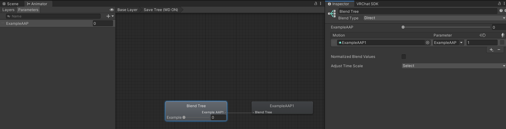

Contributors: [Jellejurre](https://jellejurre.dev/), [JustSleightly](https://vrc.sleightly.dev/)

# Animated Animator Parameters (AAP) {#29202baa8599482bb4812ef57156a0cd}

## What is an AAP? {#f715f5bee65e4b8585ee85496e3f5bda}

Animated Animator Parameters (AAPs) are Animator Controller Float Parameters that can be modified by animation clips in that same Animator Controller. This allows logic that isn’t possible without them. This article will go in depth on how to make and save AAPs, while their advanced uses will be explored more in the [Advanced Blend Tree Techniques](/docs/Other/Advanced-BlendTrees) page.

---

## How to make an AAP {#f1083e72cb064e90be5ccef09746889a}

To make an Animated Animator Parameter:

- Create a Float parameter in the Animator Controller you want to make the AAP in
- Create an Animation Clip and put it in the Animator Controller
- Place the Animator Controller in the Animator of a GameObject so the Animation Clip becomes editable
- Select your GameObject so you can edit the animation, then click `Add Property` → `Animator` → `[Name OF Your AAP]` in the animation window

 <GreyItalicText>How to add an AAP for the Example AAP Float to the ExampleAAPAnimation clip</GreyItalicText>

From here on, it behaves just like any other animated property, **except** for that it always reverts back to the default value when not animated, and you’re not able to change the value by hand as long as an AAP animation exists in the controller.

 <GreyItalicText>In play mode, AAPs are greyed out and can’t be changed except for being animated, and therefore won’t be affected by PhysBones, Contact Receivers, or your Expressions Menus.</GreyItalicText>

There are some problems with AAPs:

- AAPs only animate the value of the parameter value of the controller they are on, and do not affect other Animator Controllers such as other playable layer controllers
- AAPs are only affected by animations and cannot be set by Parameter Drivers
- Parameter Drivers cannot copy values from AAPs
	- If you want to copy their value to sync over the network, you will need to animate the distance between a Contact Sender and a Contact Receiver using the AAP and read out that value
---

## How to save an AAP {#4ef7702be77c4f8d86251862d6e0cc3b}

AAPs get reset to their default value when not actively animated.

However, there are multiple ways to save an AAP after leaving the animating state, which are outlined below:

:::caution

These layers have to be put above the other layers animating the AAP, otherwise it will overwrite the animations changing it

:::

:::tip

By using an animation which animates a different AAP, these methods can be used to copy AAPs too

:::

### Animation Clip Motion Time {#6a109e7b82ec4c4f907362e28c4c3dae}

Since AAPs are floats, they can be used as Motion Time parameters. Make an animation that sets an AAP from 0 to 1 over time, and set both tangents to `Linear`. By having a layer containing a single state with this animation clip, with the motion time set to the AAP’s float, the AAP will be re-animated every frame and saved.

For example, if the parameter value is 0.5, it will play the middle of the animation clip setting the value to 0.5, reinforcing the parameter by continually animating the AAP.

 <GreyItalicText>An example of saving an AAP using a Motion Time animation clip</GreyItalicText>

Pros:

- Doesn’t rely on default value
- Precise

Cons:

- Only works on values between 0 and 1
- Needs its own layer

### Direct Blend Tree {#9730068c176e46029b8142d99210456f}

Since AAPs are floats, they can be used as blend parameters in Blend Trees. Add the AAP to a Direct Blend Tree as a Blend Parameter animating an animation clip that sets its own AAP value to 1. The AAP needs to have a value of 0 by default, otherwise the animating won’t work for values below 1. 

For example, if the parameter value is 2, it will play the animation clip that sets the AAP to 1, with a weight of 2. The result is a multiple of the value and the weight, with a final value of 2, reinforcing the parameter by continually animating the AAP.

:::caution

As this uses Direct Blend Trees, don’t forget to make the state Write Defaults enabled, and mark the state with (WD ON) in the name.

:::

 <GreyItalicText>An example of saving an AAP using a Direct Blend Tree</GreyItalicText>

Pros:

- Precise
- Works for values above 1
- Can be put in a big DBT

Cons:

- Doesn’t work for negative values
- Relies on default value

### 1D Blend Tree {#522ecf59f2234b8ba7c09f458f328b61}

Make two animation clips, one setting the AAP to (for example) -100, and the other setting it to 100. Then, make a 1D Blend Tree with these animations at the thresholds -100 and 100 using the AAP as the parameter. 

These values decide the range your AAP will work at; the bigger the range the smaller the accuracy. You can have about 7 digits of accuracy total. If your range is -1000 to 1000, you have an accuracy of approximately 0.001.

In the example on the right, if the parameter value is 0, it will play the average of both animations, resulting in a value of 0.

 <GreyItalicText>An example of saving an AAP using a 1D Blend Tree</GreyItalicText>

Pros:

- Works for any value, even ranges not centered around 0
- Can be put in a big DBT (as a child)
- Doesn’t rely on default value

Cons:

- Limited accuracy

---
<RightAlignedText>Last Updated: 31 March 2024 08:54:00</RightAlignedText>