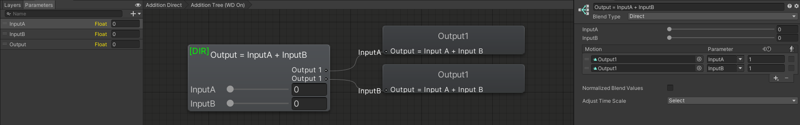
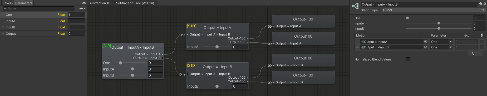

Contributors: [Jellejurre](https://jellejurre.dev/), [JustSleightly](https://vrc.sleightly.dev/)

# Advanced Blend Tree Techniques {#d7c53c8007eb4509b9aefd8f67da545a}

## Introduction {#0736f78b3ffe4e28ad156809d48eff21}

Blend Trees are powerful tools that cover a variety of use cases, from optimizing simple animator layers, to simulating complex logic equations.

For an introduction to Blend Trees, check out [Combining Layers Using Direct Blend Trees](/docs/Other/DBT-Combining) to optimize simple animator layers and save animator performance.

This article covers more advanced applications of Blend Trees, including:

- Logic Gates
- Float Remapping*
- Math Operators*
- Framerate Detection*
- Float Smoothing*

*Many applications are an extension of the [Animated Animator Parameters (AAP)](/docs/Other/AAPs) article, so it’s recommended to have read its contents.

:::caution

When using Direct Blend Trees, don’t forget to make their states Write Defaults enabled, and mark their states with (WD ON) in the name.

:::

Example images in this article use [MACS](https://mcardellje.gumroad.com/l/macs) for visualization.

- Numbers on the left of animations/Blend Trees show their Threshold in a 1D/2D Blend Tree
- Names on the left of animations/Blend Trees show their Direct Blend Parameter
- If an animation is named [Parameter][Number] it animates that AAP to that number. Output1 for example animated the Output AAP to 1

For example, on the right you will see a Direct (`[DIR]`) Blend Tree that animates a Standard 1D (`[S1D]`) Blend Tree with a weight parameter of `One`. That Blend Tree has two children, one animation clip `Output-100` at threshold `-100`, and another animation clip `Output100` at threshold `100`.

Direct and 1D Blend Trees are the only types that follow simple mathematical rules, while the other types have advanced algorithms not meant for logic but for animation, and are at best an approximation.

 <GreyItalicText>An example of the visualizations used in this article. This layer would save the Output AAP according to the 1D Blend Tree technique.</GreyItalicText>

---

## Logic Gates {#9fb199b125374b24bddb572cedb6185d}

You can use Blend Trees to simulate the logic of logic gates (like AND, OR, NOT, XOR, etc.).

These can be used to animate properties based on multiple input parameters, such as toggling a GameObject off when toggling another GameObject on, or animating a blendshape only when two other toggles are enabled.

The following examples assume 1 = True and 0 = False.

### AND Gate {#9703ba0671a94a4bb87cbd0636a00824}

_Output true, only if A_ _**and**_ _B are both true_

This example demonstrates an AND Gate using parameters `InputA` and `InputB`.

Here, the only way the `Output` animation plays is if both inputs are 1 (true).

Example template can be downloaded from [Logic: AND Gate](https://notes.sleightly.dev/justsleightly/Logic-AND-Gate-da078d692a2d4f4ebc7d44ee58b5af22).

 <GreyItalicText>An example of an AND gate.</GreyItalicText>

This table represents all of the possible outcomes:

❌ = False

✅ = True

| Input 1 | Input 2 | Output         |
| ------- | ------- | -------------- |
| ❌       | ❌       | ❌ (`Output 0`) |
| ✅       | ❌       | ❌ (`Output 0`) |
| ❌       | ✅       | ❌ (`Output 0`) |
| ✅       | ✅       | ✅ (`Output 1`) |

### OR Gate {#450c8be55ce34002ba2792e4fedc64ed}

_Output true, if either A_ _**or**_ _B are true_

This example demonstrates an OR Gate using parameters `InputA` and `InputB`.

Here, the `Output` animation can play if either input is 1 (true).

Example template can be downloaded from [Logic: OR Gate](https://notes.sleightly.dev/justsleightly/Logic-OR-Gate-faae12e6625640e4a0d341ce33f89560).

 <GreyItalicText>An example of an OR gate.</GreyItalicText>

This table represents all of the possible outcomes:

❌ = False

✅ = True

| Input 1 | Input 2 | Output         |
| ------- | ------- | -------------- |
| ❌       | ❌       | ❌ (`Output 0`) |
| ✅       | ❌       | ✅ (`Output 1`) |
| ❌       | ✅       | ✅ (`Output 1`) |
| ✅       | ✅       | ✅ (`Output 1`) |

### NOT Gate {#b77f6644cec34447a646442aef856c26}

_Output the opposite of the input_

This example demonstrates a NOT Gate using parameter `Input`.

Here, the `Output 1` animation plays if `Input` is 0 (false).

Example template can be downloaded from [Logic: NOT Gate](https://notes.sleightly.dev/justsleightly/Logic-NOT-Gate-8b391c91d02246daa8d77c0df6616e2c).

 <GreyItalicText>An example of a NOT gate.</GreyItalicText>

This table represents all of the possible outcomes:

❌ = False

✅ = True

| Input  | Output         |
| ------ | -------------- |
| ❌      | ✅ (`Output 1`) |
| ✅      | ❌ (`Output 0`) |

### Arbitrary 2-Bit Gates {#3e18b81915e0429e90a3ddd5c08da1d9}

In reality, you can make any 2-bit (or even n-bit) gate by animating every possibility.

This example demonstrates animating every output possibility, where you can replace each output clip with anything you want.

For example, an XOR gate would replace the:

- `Replace with 0,0 value` node for an `Output 0` animation
- `Replace with 0,1 value` node for an `Output 1` animation
- `Replace with 1,0 value` node for an `Output 1` animation
- `Replace with 1,1 value` node for an `Output 0` animation

Example template can be downloaded from [Logic: Arbitrary Gate](https://notes.sleightly.dev/justsleightly/Logic-Arbitrary-Gate-47b2638a3b984ef6a9f797ae9169bebd).

 <GreyItalicText>An example of a 2-bit gate.</GreyItalicText>

---

## Remapping A Value {#3d68a81b04a24c1993dbcfadc6850fca}

You can use the “1D Blend Tree” method explained in the [Animated Animator Parameters (AAP)](/docs/Other/AAPs) article to remap a value.

This is done by changing what gets animated at what time. If you want to remap the range `0` - `1` to the range `10` - `100`, you would make the Thresholds `0` and `1`, and the animations `Output 10` and `Output 100`.

An example where the range `-100` to `100` is remapped to `100` to `-100` is shown to the right. This is similar to a NOT Logic Gate that inverts/negates the output.

Example template can be downloaded from [Remap Float](https://notes.sleightly.dev/justsleightly/Remap-Float-e071b4c66fa940f6ab2e959e41e7cf9a).

 <GreyItalicText>An example of negating a float with an AAP. If the Source value is 100, the Target-100 animation will play with full weight, setting the Target AAP to -100.</GreyItalicText>

---

## Math Operators {#cb451b2bd3ee47b9bd5fd8fe66ba55a2}

Using [Animated Animator Parameters (AAP)](/docs/Other/AAPs), you can do the four basic mathematical operations (though with some caveats); Addition (`+`) , Subtraction (`-`), Multiplication (`*`), and Division (`/`).

### Addition {#1b6b02e8d0d8431eb1bd26c5a95831da}

Addition can be accomplished by animating an AAP twice in the same Direct Blend Tree, causing the effects to stack.

In the first example, we will use the 1D Blend Tree method to animate the output value. 

This can include negative values as inputs too, but is lower on precision and only works within a set range.

 <GreyItalicText>An example of adding two values by animating the Output AAP in two 1D Blend Trees in a Direct Blend Tree.</GreyItalicText>

In the second example, we will use the Direct Blend Child animation method to animate the output value. 

This can only take positive values as inputs and relies on the Output being weighted to 0 by default, but has higher precision and works for any positive number.

Example templates can be downloaded from [Math: Addition](https://notes.sleightly.dev/justsleightly/Math-Addition-89526aae758d4cc2afca3ab1cf10a1ca).

 <GreyItalicText>An example of adding two values by animating the Output AAP in two animation children in a Direct Blend Tree.</GreyItalicText>

### Subtraction {#3862a0cf896d419ab0f737966d957a6c}

Subtraction is similar to Addition but while negating the second parameter. 

The first example uses the 1D Blend Tree method.

 <GreyItalicText>An example of subtracting two values by animating the Output AAP in two 1D Blend Trees in a Direct Blend Tree. Note how the bottom blend tree animated -100 at 100 and vice versa.</GreyItalicText>

The second example uses the Direct Blend Tree Child method.

Example templates can be downloaded from [Math: Subtraction](https://notes.sleightly.dev/justsleightly/Math-Subtraction-d95e7608062b414c8d73422546f01161).

 <GreyItalicText>An example of subtracting two values by animating the Output AAP in two animation children in a Direct Blend Tree.</GreyItalicText>

### Multiplication {#47d92e363be340f799fd95b98eb9c337}

Multiplication is done by nesting Blend Trees as children of the DBT, as the child of a child Blend Tree gets played by the weight of both Blend Trees multiplied.

Both methods can only take in positive values due to the math only working when the lower value is 0, and the Direct child only works when the default value is 0.

The first example uses the 1D Blend Tree method.

 <GreyItalicText>An example of multiplying two values by animating the value through two 1D Blend Trees. Note that both inputs here go up to 10, and the last animation, Output 100, animates those two values multiplied together.</GreyItalicText>

The second example uses the Direct Blend Tree Child method.

Example templates can be downloaded from [Math: Multiplication](https://notes.sleightly.dev/justsleightly/Math-Multiplication-5ffb4806a88d4d18b563dd9f100f7e9c).

 <GreyItalicText>An example of multiplying two values by animating the value through two Direct Blend Trees.</GreyItalicText>

### Division {#7229acb83ba7465dbd50a2236b134031}

Division is done by using the Normalize Blend Values option, which takes the Blend Parameters of a Direct Blend Tree, and divides them (and therefore the outputs) by the sum of all Blend Parameters, meaning the final used Blend Parameters are normalized (add up to 1). 

Note that this only happens if the total sum of Blend Parameters is greater than 1. We can abuse this by animating a dummy animation (that animates nothing) with our input parameter, while animating the Output with a weight of 1.

For example, if the value of `Input` is `2`, then:

- `Dummy` gets animated with weight `2` and `Output1`
- This means the total weight is `1` + `2` = `3`
- So then because this is greater than 1, all weights get divided by `3`
- So `Dummy` gets animated with weight `2/3` and `Output` gets animated with weight `1/3`, giving us our output value of `1/3`

Example template can be downloaded from [Math: Division](https://notes.sleightly.dev/justsleightly/Math-Division-dff719b5573143fea038b904a616c2fe).

 <GreyItalicText>An example of division. Note that this doesn’t divide by Input, but by (1 + Input).</GreyItalicText>

---

## Frame Time Detection {#f038ff5bbe1243d69c0bb2b1c7b7bc2c}

Blend Trees get run once every frame. So at different framerates, the effects that happen over time (like float smoothing) will happen at different rates. To counteract this, you can read out the frame time (time that has passed since last frame), and multiply your effects by this number, so that over the course of a second, the full effect happens once.

To do this, we keep track of an ever increasing Time parameter, and the value it had last frame, and subtract these to get the frame time.

This setup requires two layers. One layer playing a time animation, and one layer processing that into the frame time.

Example template can be downloaded from [Frame Time Measurement](https://notes.sleightly.dev/justsleightly/Frame-Time-Measurement-18d4f473a4574f919ac3b5f9eba74825).

 <GreyItalicText>The layout of Frame Time detection layers.</GreyItalicText>

The Time Animation would be set up with two key frames, one at 0 and one at a frame far away, This example uses 20000 seconds (120000 frames). In this animation, the Time AAP would be animated between 0 and 20000, with Both Tangents set to Linear. This animation would have Loop Time on and be playing on the top layer.

 <GreyItalicText>An example Time animation.</GreyItalicText>

Then, the next layer is a Direct Blend Tree which performs two operations. 

First it sets `FrameTime` = `Time` - `LastTime` (see ). Lastly, it sets `LastTime` to `Time` so it can be used next frame.

Now the `FrameTime` is set to the difference between the time at the current and previous frame, a.k.a. the frame time. This can be used in your other Blend Trees.

 <GreyItalicText>An example Frame Time measurement layer.</GreyItalicText>

---

## Smoothing {#460ada1c048a4e618e8370a52b175634}

Blend Trees can also be used to let a float smoothly change from one value to another. There are currently two ways to do this: Exponentially and Linearly.

### Exponential Smoothing {#bffb17cfe885400fb44b9d2f9ff70e94}

In Exponential Smoothing, the difference between the current value and the target gets exponentially smaller every frame. It uses three 1D Blend Trees.

We use an 1D Blend Tree to blend between setting `Smoothed Value` to itself and setting it to the actual `Value`.

If you have a Blend Tree where you set a value A at threshold 0 and value B at threshold 1, the math is as follows for a 1d Blend Tree with parameter f:

$$
Blend(f) = \begin{cases}
A  & \quad f \leq 0 \\
A * (1 - f) + B * f  & \quad 0 \leq f \leq 1 \\
B  & \quad f \geq 1
\end{cases}
$$

So this means that since our `S``moothAmount` is always between 0 and 1, our value would be: 

$SmoothedValue = Value * (1-SmoothAmount) + SmoothedValue * SmoothAmount$

![An example of an Exponential Smoothing Blend Tree. Here the bounds are chosen to be [-100, 100], but you can change these as needed.](./711673686.png)

So the higher `SmoothAmount` is, the more it will use the old value instead of the new one, so it’s gonna “lag behind” more. Feel free to try this yourself to get a feel for what this value does. 

Example templates can be downloaded from [Smoothing (Exponential)](https://notes.sleightly.dev/justsleightly/Smoothing-Exponential-019e9e69f617451dabd8d64554e09671), [Smoothed Float (Full)](https://notes.sleightly.dev/justsleightly/Smoothed-Float-Full-c3a1c86b492b4a23bf230f3549ec5e7c) and [Smoothed Float (Half)](https://notes.sleightly.dev/justsleightly/Smoothed-Float-Half-21fe757e52da4e589e2b30997f459f44).

### Linear Smoothing {#382b25efca9e461cb97de8d819bdc057}

In Linear Smoothing, the amount that gets added or subtracted is the same every frame, so over the frames it’s linear. 

The top two 1D Blend Trees set Delta (Difference) = Value - Smoothed Value

The bottom two 1D Blend Trees set

$SmoothedValue = SmoothedValue + Clamp(-StepSize, StepSize, Delta)$ 

To clarify, the Linear Blend Blend Tree does the following:

- If Delta < -0.1, we subtract Step Size from the Smoothed Value.
- If -0.1 < Delta < 0.1, we blend Delta between itself and the Step Size
- If Delta > 0.1, we add Step Size too the Smoothed value.

Therefore we always take a step of `StepSize` in the direction of the Value, and thus get Linear Smoothing.

Example template can be downloaded from [Smoothing (Linear)](https://notes.sleightly.dev/justsleightly/Smoothing-Linear-c9ce813388b54f7a949d4e84473730ec).

 <GreyItalicText>An example of an Linear Smoothing Blend Tree.</GreyItalicText>

By adding a Frame Time Detection layer and multiplying `StepSize` by the frame time before using it, this can be frame time independent. 

---
<RightAlignedText>Last Updated: 31 March 2024 08:54:00</RightAlignedText>