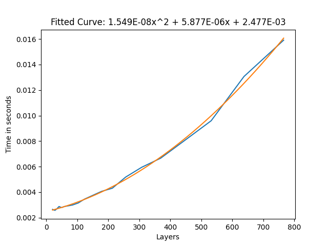
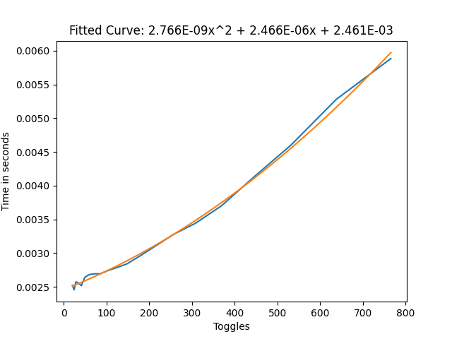

Contributors: [Jellejurre](https://jellejurre.dev/)

# Introduction {#b4cf7988e4ab4c00bdfada2cf80eed65}

This is a writeup on the performance (mostly focused on frame time) of components in Unity and VRChat.

The general methodology used to generate this data is to not look at the performance of a single instance of a Component, but to add more and more components and extract the formula for the performance from this data. For example: If we want to know how much frame time it costs to have one extra layer on an FX controller, we can have 1, 8, 64 and 256 layers, plot those on a graph, fit a line to this data, and use the formula of this line to see how much frame time it costs to add a single extra layer.

My goal is to test the performance of every single component that can be used in VRChat to give a rough estimate of how heavy they are to run compared to each other, to help the community choose more optimized methods to do things.

Throughout this article, I will give the results in ms of frame time. To interpret this, it is good to think about it like this:

If your goal is to have 90 fps, you have approximately 11 ms (so 0.011 seconds) to render each frame. This is your budget. Some of this time will be spent on PhysBones, some of it will be spent on Animators, some of it will be spent on Materials, etc. So if something takes 1 ms, you can see this as taking about 9.1% of your “budget”.

Do note that this frame time is used for processing every single avatar and the world, so if something on a single avatar takes 9.1% of the total budget, that is quite a lot, and should probably be a point of optimization.

**To have 60 fps, your frame time budget is approximately 16 ms.
To have 40 fps, your frame time budget is 25 ms.**

:::note

The graphs used in this document are generated on a computer with the following specs

CPU: AMD Ryzen 7 5800X
Memory: DDR4 2x16GB 3200 MHz CL18
GPU: NVIDIA GeForce RTX 4090

The data used throughout this document is generated using [https://github.com/jellejurre/UnityBenchmark](https://github.com/jellejurre/UnityBenchmark)

:::

Special thanks to Cibbi for contributing his data and helping me generate the controllers

---

## Animator Controllers {#53522b80ca174b369736ba6ef73f63dd}

To put the numbers in this section into perspective, I’d like to mention two points:

- Every test here is done without any state behaviours. Having one or more state behaviours on any layer of any controller increases the runtime of all controllers on that avatar by 50%. This happens regardless which state behaviour you are using, and since there are state behaviours on the default Action & Gesture layer, this cost is probably incurred on every single avatar that gets used. Because this cost is always there, I have chosen not to include it in any of my testing, since my tests are supposed to be comparative, but do note that if you’re looking at any of the raw numbers, you should probably add a 50% cost on top of it to get the actual numbers.
- Animator controllers don’t scale linearly. I will touch on this later, but having two avatars with 100 layers is not as laggy as having a single avatar with 200 layers. It is useful to optimize controllers, since less frametime is still a win, but if you get weird numbers (like the fact that if it scaled linearly, having 40 avatars with 50 layers would take 68 ms, but in reality it takes 6.4 ms)

I will first go over single controller frame time performance, and then I will go over how this scales with having multiple controllers.

### Single Controller Performance {#8b4448b945d245e5ae1309030289212a}

#### Baseline: Two state toggle

For our baseline, we are going to look at the simple 2 state toggle.

 <GreyItalicText>The default toggle we will be comparing against. Two animations, each with two frames, both with the same value. Write defaults on.</GreyItalicText>

In every layer count test, the graph for layers vs frame time is quadratic. this means that the more layers you have, the worse adding an extra layer becomes. However, the quadratic term isn’t very strong, so for low layer counts, it can be approximated by a linear graph. For the basic toggle, this will be 0.01 ms per layer. This is our baseline to compare against.

:::tip

The results shown in this graph are in the `static` case, meaning no parameters were actively being changed.

:::

 <GreyItalicText>The frame time to layer count graph for the basic toggle without being actively toggled.</GreyItalicText>

If we run this same benchmark again, but while actively animating the layers, we get the following graph.

This graph shows us that there is an approximately 20-30% higher cost for toggles that are constantly toggled, compared to ones that aren’t. This would be the case for face/eye tracking for example. This 20-30% higher cost seems to be consistent with all my setups (AnyState, AnyState self transition, multiple animators, etc.), except for direct Blend Trees, where it depends on the setup.

 <GreyItalicText>The frame time to layer count graph for the basic toggle while being actively toggled.</GreyItalicText>

#### AnyState

AnyState seems to be similar in performance to non-AnyState toggles, no matter the amount of AnyState toggles. This indicates the amount of transitions checks is not a significant contributing factor to frame time, which is confirmed by other tests.

:::caution

The only notable exception here is an AnyState toggle with “Can Transition to Self” active, as this does incur a **20% penalty over non-can-transition-to-self**, even with the constant toggling comparison.

:::

#### Direct Blend Trees

When the surprisingly large cost of layers was first discovered, people called for Direct Blend Trees as the one magical solution that would cut frame time by orders of magnitude. My results indicate that, while they don’t take zero time, they are an excellent tool in reducing frame time.

I have found two setups which are more performant than the normal layer toggles, one easier to work with, but slightly slower, and the other more difficult to set up, but slightly more performant.

For the slower setup I used a single Direct Blend Tree, with many 1D Blend Trees as children. All the children consistently had weight one, but the 1D Blend Tree blend value would be controlled for the toggles.

 <GreyItalicText>Direct Blend Tree frame time without the constant toggling</GreyItalicText>

 <GreyItalicText>Direct Blend Tree frame time with the constant toggling</GreyItalicText>

From these results we can see that this cut our frame time by approximately 3/4ths, which is very good. Especially with large amounts of toggles, this can help a lot with performance.

:::tip

To find out how to make one of these Blend Trees, I recommend reading [Combining Layers Using Direct Blend Trees](/docs/Other/DBT-Combining).

:::

:::caution

Some people use the techniques described in [Advanced Blend Tree Techniques](/docs/Other/Advanced-BlendTrees) to use blend trees for dissolves. Exponential smoothing is 2x faster than a normal toggle, but is FPS dependent. Linear smoothing with frameTime detection is FPS independent, but 2x as slow as a normal toggle. So try to use Exponential smoothing for dissolve toggles, and if you can’t, use a layer.

:::

For the slightly faster setup, there are two layers required. The first layer is a single animation which animates the defaults of all the toggles. The second layer is a single Direct Blend Tree which uses the toggle parameters to toggle the state of the toggles with one animation per toggle. 
So say for example I have a pair of shoes to toggle, and I want them on by default, then on the first layer in the big animation I’d animate the `IsActive` value to true, and on the second layer in the big Direct Blend Tree, I’d put an animation which animates the `IsActive` value to false, with the blend parameter being the parameter that I want to use. So when the parameter is 0, the animation weight is 0 and the default layer takes over, and when the parameter is 1 the animation is 1 and it overwrites the default layer.

 <GreyItalicText>Direct Blend Tree frame time with default animation layer without constant toggling</GreyItalicText>

 <GreyItalicText>Direct Blend Tree frame time with default animation layer with constant toggling</GreyItalicText>

From these results we can see that we cut or frame time by approximately 4/5ths over the simple two state toggles, and by 50% over the 1D Blend Tree setup in the active case, which is quite a big improvement, but how it works might be less clear and it can be more work to set up.

If you are constantly switching toggles (for example you’re building some face tracking setup or you’re using the voice parameter a lot), it might be an idea to use this, but otherwise, personally I’d stick with the two state setup. 

#### Miscellaneous

Now for some miscellaneous data which doesn’t directly relate to toggles, but might be useful to someone:

- State count per layer and transition count don’t seem to matter much (which might be why AnyState is so cheap)

	:::caution
	
	The only time where this isn’t true is if there are many bool transitions out from a single state (many here meaning 1000 for 1 ms). Float/Int seems to not have this added overhead
	
	:::
	
	

- Using empty layers on humanoid rigs, using non-humanoid rigs and using no avatar all seem to cut frame time per layer by about 50% compared to the two state setup
- Masking seems to have little to no effect on frame time
- Using sub-state machines seems to have little to no effect on frame time
- Nesting blendtrees for clarity seems to have little to no effect on frame time
- For Direct Blend Trees, WD off seems to not change frame times by much
- For layer toggles, WD off seems to increase frame time by around 50%
- Parameters on the local avatar seem to cost 1.5 ms per 1000, but this cost doesn’t apply to remote avatars

### Multiple Controller Performance {#5b4def9bfebe4193b32c5a6559771a79}

:::caution

Having multiple controllers does NOT scale linearly (that is, having 2 controllers with 100 layers causes way less lag than 1 controller with 200 layers).

:::

The actual relationship is hard to describe, but here is a visual to maybe help with this. Where every line is a constant frame time. So for example 5 controllers with 580 layers are as laggy as 15 controllers with 300 layers.

I see two main takeaways from this graph:

- Big controllers cause a lot of frame time compared to many small ones. Optimization is especially necessary if you have many layers. (1 100 layer controller takes as much frame time as 10 30 layer controllers).
- Even with many controllers, if you halve the layer count on all of them, your total frame time still goes down by 50%. So if everyone optimized their layer count/layer setup, this would increase performance for everyone.

:::tip

This relation seems the same for all controller types/layer configurations.

:::

 <GreyItalicText>Frame time for controllers vs layers per controller with WD on two toggle states without active toggling.</GreyItalicText>

### Face Tracking {#eae81b01bded43f984ceccf46942a730}

Since face tracking takes up many layers, I wanted to do a comparison between a normal VRCFT controller, and a FX controller generated by Razgriz’s [VRCFTGenerator](https://github.com/rrazgriz/VRCFTGenerator) (which packs the layers into Blend Trees). 

I won’t bore you with the graphs, since they are just a straight line, but as for the data (this is with 37 face tracking parameters): 
- VRCFT: 0.1733 ms per controller
- VRCFTGenerator: 0.066 ms per controller, a 62% decrease over the non Blend Tree version.
---

## Constraints {#caec003575e446d2bf97a8a23de7daf8}

After animator controllers, I’m very happy to talk about something simple. Constraints behave weirdly, but in a very predictable way.

Take the total amount of enabled constraints (type doesn’t matter) and use this graph to get the frame time. You can see that there are slow inclines, until a big jump. When VRChat was choosing their limits for constraints, they chose 681 to make sure you don’t have to take the penalty for that big jump, and I think that makes a lot of sense, since it goes from 1.7 ms to 2.4 ms (above the 0 point, which is 2 ms in this graph). 

The jump alone there would take up 6% of your total frame budget for 90 fps, and that is without the performance cost of the constraints factored in.

An approximation for their performance would be 2-4 ms per 1000 constraints, but that is assuming you don’t go over 1250 constraints total enabled at the same time, since it goes up fast after that.

:::tip

Disabled constraints do not count towards this total graph. Disabled here means either:
- GameObject is disabled
- Constraint component is disabled
- Constraint is set to “disabled”

However, setting the weight to 0 still makes it count for performance!

:::

 <GreyItalicText>Frame time of constraints</GreyItalicText>

---

## Audio Sources {#0aa8f1f5ef8741579fb8e92b44fe3163}

Try as I might, I can’t seem to make these have any performance impact at all, even in unity where the max is 64 compared to VRChat’s 3 per avatar.

---

## Contact Senders/Receivers {#f1c3c67f6e384fb7b8a853fdcc29f95a}

The first thing I want to say is that contacts have a max limit of 4096 per instance. If you have more than 4096 contacts in one instance, some will stop working

Contact senders and receivers are pretty straightforward as well, costing:

- 0.5 ms of frame time for every 1000 senders/receivers while they aren’t actively being toggled
- 0.75 ms of frame time for every 1000 receivers while they are actively being toggled

:::tip

These values seems to be roughly the same no matter the shape, type, parameter count, and collision tags

:::

:::caution

Do note that this isn’t factoring in the time of parameters on your local avatar. Parameters on the local avatar have an extra cost of 1.5 ms per 1000 parameters

:::

---

## Cloth {#fbcfa24e24804883b2ef8d7fb7288e21}

Cloth components are very heavy and should be used very sparingly.

For any reasonable amount of vertices (up to ~200k vertices), a cloth component will add around 0.2 ms per 1000 vertices. Above this, the frame time shoots up hard before tapering off, but this is only with unreasonable amounts of vertices.

Note that this 200k vertices limit is for the entire lobby. The amount of cloth components does not seem to matter for the lag, just the amount of cloth vertices.

:::caution

Note that due to mirror and shadow clones, the local avatar’s cloth is simulated three times, and therefore its vertices should be counted thrice

:::

:::tip

Colliders will make a cloth component take about twice as much frame time per 10 colliders. So per collider, it will take about 7% more frame time.

:::

 <GreyItalicText>Frame time of cloth with changing vertex count</GreyItalicText>

---

## PhysBones {#adb92e7129ff428a8c3b0fc2ae45714f}

Physbones are quite well optimized, and within reason can be considered pretty cheap. It seems that the frame time of PhysBones is mostly reliant on how many transforms they animate, at a rate of 0.66 ms per 1000 affected PhysBone transforms. 

The component hierarchy shape (what is parented to what) and amount of components seem to have a slight effect on this, giving me a 33% difference between extremes, where fewer components is better. 

Collider count has a very slight impact on frame time, and the other settings seem to have no noticeable effect.

:::caution

Since PhysBones’ runtime is very different in VRChat and Unity, these results are gotten from tests within VRChat. While usually the results are verified in VRChat, this time all the data is from VRChat, and therefore the results may be less accurate.

:::

 <GreyItalicText>Frame time of Phys Bone Transforms</GreyItalicText>

---

## Skinned Mesh Renderers {#3a6a07f5614048f1b60ce344e0f9cef3}

Skinned Mesh Renderers are quite the important topic for optimization, as material count and vertex count can be one of the most difficult things to optimize on an avatar. They are mostly reliant on the GPU, so it is important to mention that these results have been obtained on a RTX 4090, however the general trends have been verified on a RTX 3080 and a GTX 1080Ti.

:::caution

These benchmarks only look at frame time, not VRAM, which is another performance metric heavily affected by meshes and their properties (especially blendshapes).

:::

### Materials {#d329f332f05b4555a329efb5bb56abb4}

A “Draw Call” is when your CPU tells your GPU to render a mesh. Every material gets seen as a separate mesh and therefore gets its own draw call. 1 mesh with 3 materials is 3 draw calls, and 3 meshes with 1 material is also 3 draw calls.

It is generally understood that more draw calls = more frame time, and my benchmarks seem to support this.

So, 100 skinned mesh renderers using 1 material have about equal frame time as 1 skinned mesh renderer with 100 materials. 

As for concrete time numbers: 1000 draw calls seem to take about 2 ms.

 <GreyItalicText>Frame times of Material Count vs Mesh Count. Note that the graph is quite symmetrical across the red line, meaning that 40 meshes with 60 materials has nearly the same frame time as 60 meshes with 40 materials.</GreyItalicText>

### Bones {#a0609ab86fd144bbadeb4f57ca31e019}

Adding more bones to a skinned mesh renderer showed they seem to take about 0.32 ms per 1000 bones (while moving, however all bones move almost all the time). Do note that if you use PhysBones to move that many bones, the PhysBones would cost another 0.66 ms per 1000 bones.

:::tip

Vertex count did not seem to matter much for Bone or Material tests, but the Standard shader was used for all of these, so it might matter more for more intensive shaders that do heavy per-vertex calculations.

:::

 <GreyItalicText>Frame time of bones on a Skinned Mesh Renderer</GreyItalicText>

### Blendshapes {#a2d0ed738bac4f348a092e6c96b822a3}

Blendshapes are the one test where vertex count mattered, but not by a lot. Blendshapes seem to take 0.005 ms per million vertices per blendshape, if all blendshapes are actively being changed. 

Some interesting information:

- For frame time, It doesn’t seem to matter if only one vertex, or all vertices are being changed by a blendshape
- For frame time, Inactive blendshapes seem practically free

:::danger

Blendshapes still have a VRAM cost, even when not changed, so they should still be eliminated where-ever possible.

:::

---

## Other components? {#d672e86efd5f43b99773069fd9478757}

I am planning to continue benchmarking components after this. Some components I have already started on, but I’m not sure enough yet about my data to post it. 

The components I want to benchmark in the future are:

- Particle Systems
- Lights
- Animations (whether value / reference matters, whether the amount of animated properties matters)

Once I’ve got to them, I’ll add them to this document

If you have other things you want me to benchmark or you think I made a mistake, feel free to let me know on discord at @jellejurre#8585

---
<RightAlignedText>Last Updated: 04 June 2024 19:53:00</RightAlignedText>