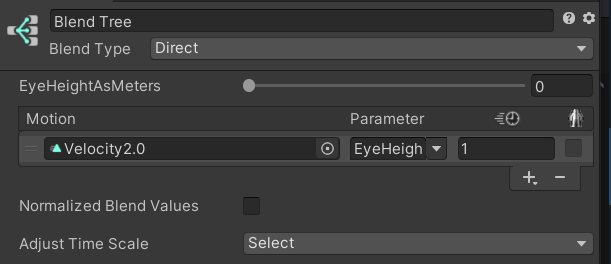

Contributors: [Jellejurre](https://jellejurre.dev/), [JustSleightly](https://vrc.sleightly.dev/)


# Designing Scale-Friendly Systems {#7042deaa6d19442cb40e3879b6232c87}


## Scaling in VRChat {#4f1097a40aab4bee9d4bb699a8ba52be}


VRChat recently added Avatar Scaling to the game. Players can scale their avatar using the hand circle menu between the minimum and maximum. By default, these values are 0.2m and 5m, but these can be set by worlds to be anything from 0.1m to 100m, and worlds can even force avatars to be a certain height. Worlds can also disable scaling if they want, but by default, scaling is enabled.


:::note

Avatars that are uploaded with sizes outside of the default size range won’t be scaled by default, but will be set to a value inside of the range when the user uses avatar scaling or when the world forces a certain avatar height. You can’t upload an avatar with a shoulder height lower than 0.1m, but you can upload an avatar with any height above that.

:::


This scaling update may break older systems, which use static offsets in certain places, and aren’t designed to change scale. This article will go over how to design systems or modify systems to work in this new scaling environment.


The general rule for creating scale-friendly systems is that whenever the avatar scales, you want all relative effects to be the same. This means that for example the distance between two objects, or the distance an audio source can play, should scale with avatar height.


:::caution

It seems that VRChat currently does not late sync scale parameters. All scale related float parameters seem to be set to 1.0 for late joiners. Hopefully this will be fixed soon.

:::


---


### Shader Material Properties {#dd70c591f3af4678808f9f5ec08052b9}


Depending on the shader and what properties you use, some values may be absolute instead of relative, and not scale well with your avatar. Examples include many properties that utilize offsets from the surface/UV, such as vertex offset, point-to-point dissolve start/end values, and geometric dissolve offsets.


You may be able to resolve some of these properties with avatar scale with , or in some cases even utilizing [vertex colors](https://www.poiyomi.com/general/textures-and-colors#vertex-colors).


---


### Constraint Components {#8415330c761649419b5c753f3f2d3c1b}


Constraint components all respond quite well to scaling, since offsets are relative to constraint target scale. The only exception to this is <u>parent constraint offsets</u>. Their offsets are absolute, and don’t scale with target scale in Unity. 


VRChat has implemented a change for this, where in VRChat, parent constraints offsets scale with target scale. This means that parent constraints react differently in Unity and in VRChat.


:::tip

The latest version of the [AV3 Emulator](https://github.com/lyuma/Av3Emulator) emulates this relative behaviour in unity.

:::


---


### World Constraints {#93b7d7e7b17a48508919828c21918537}


World constraints require a bit more care to work properly with scale, since we don’t want the offset from the world origin to scale (which would move the object), but we do want the object in the container to scale. 


To achieve this, you would want to add a Scale constraint to the `World Constraint` GameObject, with as source the World prefab. This will make it so the object doesn’t move when scaling.


If you want the prop itself to scale with your avatar, you would want to add another scale constraint to the `Container` GameObject with the source as your avatar.


:::note

The latest version of the [VRLabs’ World Constraint](https://github.com/VRLabs/World-Constraint) has the World prefab scale constraint already added. Note that this doesn’t include the prop scaling, you will need to add this yourself if you want it.

:::


---


### Cloth Components {#08a040cd49f24569aea40fdfdcefb396}


Cloth components scale on their own except for that they need to be disabled and re-enabled for the offsets to be calculated properly. This is currently done in the latest VRChat Open Beta when scaling.


:::tip

The latest version of the [AV3 Emulator](https://github.com/lyuma/Av3Emulator) on the master branch emulates this cloth toggle behaviour in unit.

:::


---


### Particle Systems {#3afc6815bcfd4829947900eede2a48ab}


For particle systems to scale, their `Scaling Mode` needs to be set to `Hierarchy Scale`. However, even if this property is set, you might need to animate other properties with avatar scale, such as properties involving speed/gravity/velocity. How this is done is elaborated on in the  section.


---


### Physics Components {#424514ad999e4dabab50eabbea734dab}


Some properties of Rigidbodies and Joints may not scale as intended, and may require certain properties (such as limits/velocity) to be scaled along with avatar size. How this is done is elaborated on in the  section.


---


### Audio Sources {#1535ebb070bd45d2bf0d4074db88b863}


These components don’t scale very well either, and will likely require their falloff distance property to be scaled along with avatar size. How this is done is elaborated on in the  section.


---


## Scale Friendly Animating {#f29427e831b748a887a288edc489d925}


To animate properties relative to avatar scale, VRC has provided 5 [read-only native parameters](https://creators.vrchat.com/avatars/animator-parameters/#avatar-scaling-parameters)

- `ScaleModified` is a bool that returns True if your Avatar is not your default scale via avatar scaling
- `ScaleFactor` and `ScaleFactorInverse` are relative values based on your Avatar’s default scale upon upload, which are more effective for quick drop in Direct Blend Tree (DBT) multiplications to modify your existing animation clips made for your current avatar
- `EyeHeightAsMeters` and `EyeHeightAsPercent` are absolute values based on the World’s units that are more effective if you need a more universal solution, such as for prefabs/systems that need to be applied to any avatar at any default size, and may take more effort/math to convert your animation clips to work with
- `EyeHeightAsPercent` is the only parameter that is normalized and compatible with state motion time (with values ranging from 0.0 - 1.0), as long as the avatar height is between 0.2m and 5m (which are the default limits)
- `EyeHeightAsMeters` is the only one that scales linearly beyond the 5m Avatar scale limit towards the Udon max of 100m

Testing Avatars 3.0 animations can be done using the [https://github.com/lyuma/Av3Emulator](https://github.com/lyuma/Av3Emulator) which can be found as a [curated package](https://vcc.docs.vrchat.com/vpm/curated-community-packages) in the “Manage Projects” section of the [VRChat Creator Companion](https://vcc.docs.vrchat.com/).


### Using `EyeHeightAsMeters` with Direct Blend Trees {#12ffd925c0fd4776b0116e01ead50121}


This method is one of the most universal ways to make an animation clip scale. Its primary advantage is being compatible with scaling both static and non-static clips, as every keyframe in the animation clip will have it’s value multiplied with scale. Its limitations are that <u>all the values</u> are scaled with your Avatar scale, and that they are scaled <u>linearly</u>. If you have any properties that should not have their values multiplied (such as weights normalized between 0 and 1), you may need to separate those properties out to another animation clip.


If you have a value you want to convert to scale linearly with avatar scale, you can divide this value by your Avatar’s Viewpoint Y value to get the value per meter, and animate this with a Direct Blend Tree (DBT) with blend parameter EyeHeightAsMeters to get a linearly scaling animation.


<div class='notion-row'>
<div class='notion-column' style={{width: 'calc((100% - (min(32px, 4vw) * 1)) * 0.5)'}}>


As an example, say your particle system has a velocity of 3.0 and your avatar has a default viewpoint Y height of 1.5m. 


You would then make an Animation Clip with two keyframes, with both frames setting the velocity to `3.0 / 1.5 = 2.0`. This animation would be played in a Direct Blend Tree with `EyeHeightAsMeters` as a direct blend parameter.


In game, say your height is 1.5m, the actual value would then be `Value * EyeHeightAsMeters` or `2.0 * 1.5 = 3.0`, as expected. 


If you change your avatar scale to 3.0m (twice as big), the values would be `2.0 * 3.0 = 6.0` (twice as large). Your value now scales linearly with avatar height.


</div><div className='notion-spacer'></div>

<div class='notion-column' style={{width: 'calc((100% - (min(32px, 4vw) * 1)) * 0.5)'}}>


<br/><GreyItalicText>The Direct Blend Tree from the example.</GreyItalicText>


</div><div className='notion-spacer'></div>
</div>


:::caution

This will work by default for values above 1 meter, but if you want it to work for values below 1 meter, you will need to put everything you’re animating in the clip at 0 when uploading, or you would need a reset layer above this one where you animate the values to 0. In our example, we could either set the particle system velocity to 0 when uploading, or animate it to 0 in a layer above this one.

:::


:::caution

When mixing a WD On Direct Blend Tree with WD Off states in the same animator layer, you may experience issues if there are any transitions outbound of the DBT with transition duration. This includes AnyState transitions. This behaviour is only observed in VRChat after upload, and not in the native Unity Editor.

:::


Note that, as all Direct Blend Trees, the state this Direct Blend Tree is in should be Write Defaults On, and have the text `(WD On)` be somewhere in the name of the state. More information on this can be found at the [Write Defaults](/docs/Unity-Animations/Write-Defaults) page.


### Using `EyeHeightAsPercent` with Motion Time {#ec7c7add67b540feb0f801030327983a}


This method’s primary advantage is being able to mix non-scaling and scaling properties together in the same animation clip, as well as being able to scale non-linearly if necessary, all without needing a Blend Tree. Its limitation is that it is only compatible with static animation clips that do not actively change values when the state is entered, because the use of Motion Time normalizes the duration of the animation clip. This is also limited to the scalable range of Avatars, and may cause unintended behaviour if worlds enforce scaling beyond the avatar scale maximum of 5 meters.


If you have a value you want to convert to scale linearly with avatar scale, you can divide this value by your Avatar’s Viewpoint Y value to get the value per meter (_unit value_). Afterwards, divide your _unit value_ by 5 to get the value of the first keyframe of your new scale-friendly animation clip, and multiply your _unit value_ by 5 to get the value of the last keyframe of your new animation clip. You can then add this animation clip to a state with motion time parameter `EyeHeightAsPercent` to get a linearly scaling animation.


---


## For Shader Developers {#ee3fabc05137428c8e2ce37b5c970316}


<div class='notion-row'>
<div class='notion-column' style={{width: 'calc((100% - (min(32px, 4vw) * 1)) * 0.5)'}}>


If you are writing any shaders for your system, it is possible you may need to take scale into account for specific effects. 


While animating a value on the material is always an option, if the shader is applied to a non-skinned mesh renderer, it is also possible to get the object scale directly in the shader like so:


</div><div className='notion-spacer'></div>

<div class='notion-column' style={{width: 'calc((100% - (min(32px, 4vw) * 1)) * 0.5)'}}>


```c#
float3 worldScale = float3(
	length(float3(unity_ObjectToWorld[0].x, unity_ObjectToWorld[1].x, unity_ObjectToWorld[2].x)), // scale x axis
	length(float3(unity_ObjectToWorld[0].y, unity_ObjectToWorld[1].y, unity_ObjectToWorld[2].y)), // scale y axis
	length(float3(unity_ObjectToWorld[0].z, unity_ObjectToWorld[1].z, unity_ObjectToWorld[2].z))  // scale z axis
);
```


</div><div className='notion-spacer'></div>
</div>


---
<RightAlignedText>Last Updated: 31 March 2024 08:54:00</RightAlignedText>