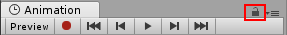
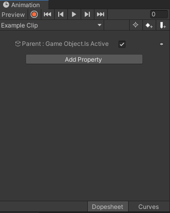
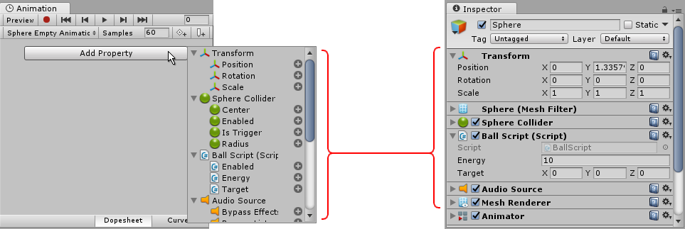
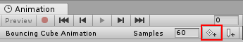
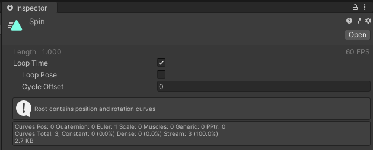

Contributors: [Jellejurre](https://jellejurre.dev/), [JustSleightly](https://vrc.sleightly.dev/)

# Animation Clips {#0fcb964389c14a2086a05f7f02542cbd}

## Creating An Animation Clip {#165d44922fb94597999b3095cda0384c}

Animation Clips are asset files that end in file extension `.anim` and can be created in a number of ways:

1. `Right-Click` in your Project window and Create an Animation Clip from the Context Menu.

2. Click **Create** from the Animation window if this option is available. See [Animators](/docs/Unity-Animations/Animators) for details on when this option appears. Select a Name and File Path for the new clip.

3. Click **Create New Clip** from the Animation Clip Name dropdown in the Animation window if this option is available. See [Animators](/docs/Unity-Animations/Animators) for details on when this option appears. Select a Name and File Path for the new clip.

---

## Opening the Animation Window {#42a209a5f7ba43e0a56a6ca0dce7e83f}

The Animation window can be opened via any of the following methods:

1. Open from the top toolbar Window → Animation → Animation
2. Right click any other window and Add Tab → Animation
3. Keyboard Shortcut `Ctrl + 6`
4. `Double-Click` any existing Animation Clip

---

## Navigating the Animation **Window** {#b6fad730bb27412fba04dbb1a0cc3588}

### Navigation Bar {#0475da4073884ba98b63595439627a3d}

#### Record Mode vs Preview Mode

There are two distinct methods you can use to animate GameObjects in the Animation window: **Record** Mode and **Preview** Mode.

In **Record** mode, Unity automatically creates keyframes at the playback head when modifying any animatable property. Press the button with the red circle to enable record mode. 

The Animation window time line is tinted red when in record mode.

In **Preview** mode, modifying your animated GameObject does not automatically create keyframes. Press the **Preview** button to enable preview mode. 

The Animation window time line is tinted blue when in preview mode.

Note: In record mode, the Preview button is also active, because you are previewing the existing animation and recording new keyframes at the same time.

#### Lock Window

You can lock the Animation window so that it does not switch while you’re still able to select and manipulate other GameObjects in the Scene.

### Animated Properties List {#4639c1801f2e4386ba36400addbc47c0}

The left side of the Animation window is a list of the animated properties. 

It starts empty, and will display animated properties added in the format of `Object` : `Property`.

Each property may have a foldout to reveal the exact values recorded at each keyframe.

The Object paths are relative to the clip’s Animator and will animate nothing if the path is invalid.

Selecting a property and pressing `F2` will edit the Object path.

### Animation Timeline {#f1f68c12852f4be2af27cf705989a828}

The right side of the Animation window is the timeline for the current clip.

1. Diamond symbols are **Keyframes**
2. The white line is called the **Playback Head** and can be moved by clicking on the timeline directly
3. Animation Property Values reflect the current value at the current frame of the Playback Head
4. Animation Timeline is measured in **Seconds:Frames** with a default Sample Rate of 60 Frames per Second

#### Dopesheet Mode vs Curves Mode

1. Dopesheet mode offers a more compact, simple overview of the keyframe timing for multiple properties or GameObjects.
2. Curves mode displays all selected properties appear overlaid within the same graph view.
	1. We won’t be using Curves mode much in this guide, but for more information, check the official [Unity Documentation](https://docs.unity3d.com/2019.4/Documentation/Manual/animeditor-UsingAnimationEditor.html).
---

## Keyframing Animation Properties {#9bb6db6feb91418eb8326c8c92ef1ccb}

### Adding Animation Properties/Keyframes {#a43c618a1ad2457fb350644b3c344533}

There are four main ways to add properties to any Animation Clip. 

**1. Record** is probably the fastest way of animating properties

2. Manually Click **Add Property** at the bottom of the Animation Property list to pop up a list of animatable properties

3. `Right-Click` the property label of the property you’ve modified while in **Preview** mode

4. Add a keyframe by clicking the **Add Keyframe** button in the Animation window

	a. Requires existing property to be selected first

#### Example Animation Clip

 <GreyItalicText>Example: Quickly Creating a 360 Spin Animation</GreyItalicText>

### Setting Keyframe Tangents {#7eb6cd64e9fa4cb884f8cf5b09266d65}

When keyframes in a timeline have different values, the animation will try to blend/interpolate in between the values. This is considered the **Animation Curve**. How that blending behaves can be controlled pretty precisely.

Every key has two **tangents** that determines how the value of that key is entered and exited: the left-incoming slope and the right-outgoing slope. 

By `Right-Clicking` a key, you can reveal tangent options. You can also use `Ctrl + A` to select all keyframes at once.

| Clamped Auto      | **Default: Automatically sets curve to pass smoothly**                                |
| ----------------- | ------------------------------------------------------------------------------------- |
| Auto              | Legacy version of Clamped Auto for Backwards Compatibility. Use Clamped Auto instead. |
| Free Smooth       | Freely set tangents, but left/right are locked to be co-linear to ensure smoothness   |
| Flat              | Tangents are flat/horizontal                                                          |
| Broken - Free     | Broken lets you set separate left/right tangents. Freely set tangents.                |
| Broken - Linear   | Blend linearly to next keyframe                                                       |
| Broken - Constant | Retain value until next keyframe                                                      |

 <GreyItalicText>Ctrl + A then Right Click to set all keyframes’ tangents at once</GreyItalicText>

Take the previous example animation clip and compare the following **Clamped Auto** vs **Broken - Linear** tangent modes

 <GreyItalicText>Cube spinning 360 degrees with animation curve set to Clamped Auto</GreyItalicText>

 <GreyItalicText>Cube spinning 360 degrees with animation curve set to Linear</GreyItalicText>

---

## Animation Clip Settings {#b6ca11dc13ec419b920632453fa385aa}

### Loop Time

Indicate whether or not this animation clip should loop upon reaching the end of the timeline.

### Loop Pose

Indicate whether or not this animation clip should add an extra keyframe between the first and the last when looping to make the looping seamless.

### Cycle Offset

How far into the animation clip the animation clip should start playing. If this is set to 0.5, it will start playing halfway through.

 <GreyItalicText>Animation Clip Settings</GreyItalicText>

The other settings on an Animation Clip’s Inspector are less commonly used, and often don’t appear unless you’re dealing with [humanoid animations imported from outside of Unity](https://docs.unity3d.com/2019.4/Documentation/Manual/AnimationsImport.html).

---
<RightAlignedText>Last Updated: 31 March 2024 09:00:00</RightAlignedText>