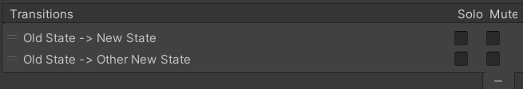

Contributors: [Jellejurre](https://jellejurre.dev/), [JustSleightly](https://vrc.sleightly.dev/)

# Animator States {#8fd00152802344d6aca5c77c3c5c2191}

Animator States are individual states in the Animator Controller Layer State Machine. Each Animator Controller Layer is either playing a single state or transitioning between two states.

When in a state, it plays the corresponding Animation Clip or Blend Tree. During transitions, it blends the Animation Clips/Blend Trees of both states together.

Details on Entry/Exit/Any States and blending can be explored further on the [Animator Transitions](/docs/Unity-Animations/Animator-Transitions) page.

 <GreyItalicText>A default Animator State’s Inspector</GreyItalicText>

---

## Motion {#7e0af0552e8049f3b8cdc547fa846783}

The `Motion` field holds the Animation Clip or Blend Tree for a state. You can select an Animation Clip from the project folder or drag and drop it into the Motion field. To create an Animator State with a Blend Tree, `Right-Click` → Create State → From New Blend Tree.

---

## Speed {#de369180145c45ffae2cb63a5fa86bba}

The `Speed` field sets speed of the Animation Clip or Blend Tree. This can be changed to a positive or negative value, allowing for animations to play in reverse. Any float can be entered here, including 0, 1.5, -7.2 and Infinity. 

Checking the `Parameter` checkbox next to the `Multiplier` field allows you to enter a Float parameter from the current Animator Controller, allowing you to multiply the `Speed` value by the value of that parameter.

---

## Motion Time {#2cc45140c1d94ed490c283cb8c766df0}

The `Motion Time` field allows a parameter to be used to scroll through the time of the Animation Clip/Blend Tree. To activate it, check the `Parameter` checkbox next to the `Motion Time` field and enter a Float parameter from your Animator Controller. The scrolling is done based on the normalized time of the animation. 

Example: For a 5 second long Animation Clip, and a `Motion Time` parameter set to 0.6, it will play the frame at 3 seconds into the Animation Clip and stay there until you change the Motion Time parameter.

Note that this does respect the `Loop Time` toggle on Animation Clips. So if you do this on an Animation Clip with `Loop Time` on, a parameter of 1 will play the frame at 0% into of the animation clip (the very start), and a parameter of 1.5 will play the frame at 50% into the animation clip (the middle).

---

## Write Defaults {#1860940e46be44c29724bd7de6cc34ce}

The `Write Defaults` field determines the persistence of changes made during an animation. When enabled, animated fields return to their default state upon leaving the Animator State. When disabled, the changes persist.

:::caution

This feature has a lot of unexpected behaviour attached to it, especially with the setting disabled. More information on the kinds of glitchy behaviour you can expect and how to protect against it can be found at [Write Defaults](/docs/Unity-Animations/Write-Defaults).

:::

---

## Transitions {#045df9e01bdb42caa53620fb8659d7fc}

Animator State Transitions determine whether the current Animator State persists or transitions to another state.

It first checks Any State Transitions, then evaluates outgoing Transitions from the current state. If a matching transition is found, it plays that transition and moves to the target state. More details on Animator State Transitions are available at the [Animator Transitions](/docs/Unity-Animations/Animator-Transitions) page.

The `Mute` field disables a specific transition, while the `Solo` field disables all other transitions. However, these features are not commonly used.

 <GreyItalicText>A list of two transitions, one to New State, and one to Other New State. The transition to New State would take priority here.</GreyItalicText>

---

## Advanced Details {#01c0997fe48f47d1be9f217e6c427e78}

### Mirror {#bb222bf92d494de7aad9292f69a1e2c2}

The `Mirror` field allows you to Mirror the humanoid parts of the State’s Animation Clip/Blend Tree. It applies properties from left Humanoid Muscles to the right ones, and vice versa. This does the same as the `Mirror` field in the Animation Clip’s Inspector. 

Check the `Parameter` checkbox next to the `Mirror` field to use a Bool parameter from the Animator Controller. This enables changing the `Mirror` value by adjusting the parameter's value.

---

### Cycle Offset {#23dcc3bede4d4c4db3993e7c2775d3ec}

The `Cycle Offset` field sets the starting point of the animation loop. Having a Cycle Offset of 0.2 means the animation is always 0.2 times the animation length ahead of the usual time.

To dynamically control it, check the `Parameter` checkbox next to the `Cycle Offset` field. This allows entering a Float parameter from the Animator Controller, enabling adjustment of the `Cycle Offset` by changing the parameter’s value.

**Example:** If you have a `Motion Time` parameter set to 0.5 and `Cycle Offset` set to 0.2, the frame played would be at 70% into the animation. 

It respects the Animation Clip’s `Loop Time` property, so a `Motion Time` parameter set to 0.9 and `Cycle Offset` set to 0.4 would play the frame at 30% into the animation.

---

### Foot IK {#4bdc9aa5ec57454c87b3a91e9e4ed8b3}

If both the `Foot IK` toggle and the Layer’s `IK Pass` setting is enabled, the IK solver does extra work to make sure the feet IK is as close as possible to the IK targets. Since VRChat does not use the Animator Component’s controllers for its IK, this is useless for VRChat Animators.

---
<RightAlignedText>Last Updated: 31 March 2024 08:54:00</RightAlignedText>