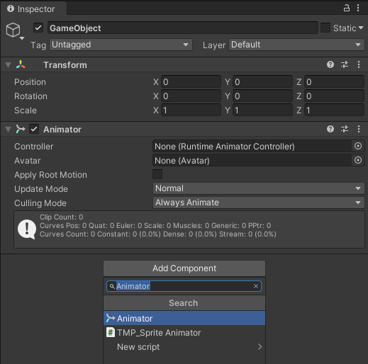
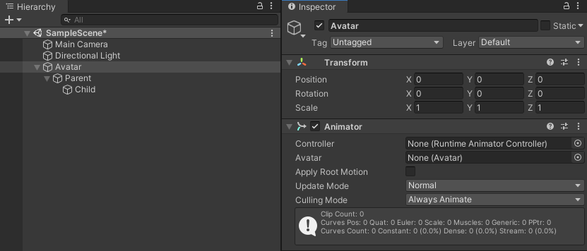

Contributors: [Jellejurre](https://jellejurre.dev/), [JustSleightly](https://vrc.sleightly.dev/)

# Animators {#8c70354f5e9c4133870de5128bbf2276}

## The Animator Component {#d697ba6243d249edb69b06e94972b4e6}

The Animator Component transforms Animation Clips from your Animator Controller into real changes on your avatar. While you can add it manually, Unity automatically places it on any FBX file with an avatar definition.

To do this automatically:

1. Open the model inspector.
2. Choose `Create from this Model` or `Copy From Other Avatar`.
3. Ensure your FBX has a Humanoid or Generic rig.

 <GreyItalicText>The Animator Component as seen in the in the GameObject Inspector</GreyItalicText>

 <GreyItalicText>The Animator component can be added to any GameObject via the Add Component button in the Inspector.</GreyItalicText>

---

## Using the Animator Component {#598b2bb8876b4fcb80dd4d09baf6cc0c}

The animator component has a few usage quirks:

### Animation Clips are Relative to the Nearest Parent Animator Component {#0b8aae5ca09f449398566aaf5d4596d5}

When animating a GameObject, a property’s target path omits the Root Animator GameObject. For example:

If we want to animate `Child` relative to the Animator on the `Avatar`, the Animation Clip’s path will be `Parent/Child`

If we want to animate `Child` relative to the Animator on the `Parent`, the Animation Clip’s path will be `Child`

Adding properties to the Animation window will add property paths relative to the nearest parent Animator component.

### Animator Components Control The Animation Window {#4fb71cb5e9f7426697b5425a401bd824}

The Animation Window changes depending on the nearest Animator component on itself or any parents.

1. The Animation Window looks like this if there is no Animator detected, no Animator Controller detected, or if your Animator Controller in the Animator does not have any Animation Clips.

2. The Animation Window will display your selected Animation Clip if you select it from your Project window, but options such as `Preview`, `Record`, and other editing features will be unavailable unless you select a GameObject in your Hierarchy with an Animator somewhere above it.

3. With an Animator component, an Animator Controller, and at least one Animation Clip in that controller, the Animation window will become fully available.

---

## Advanced Details {#2157fc987c2845e8bc18e9606a5557dc}

### The Component Fields {#89679d3b9ac54299afb004022b1b10f7}

The Animator component has five fields to interact with:

#### Controller

The Animator Controller, found in the `Controller` field, acts like the brain of your animations. It decides what parts of your GameObject and its children should move and how they should move by using Animation Clips at different times, weights, and masks.

:::caution

On VRChat avatars, the Animator's `Controller` field isn't used. Instead, it's replaced by a combination of Playable Layers in the VRC Avatar Descriptor. This change doesn't affect Animators on child GameObjects; they still use their assigned Controller.

:::

---

#### Avatar

The `Avatar` field provides the Animator more information on how its GameObject and its children are connected. It can be used to create Animator Layer Masks and, in the case of Humanoid Rigs, animations generic between multiple avatars. There are four types of Avatar:

- Humanoid: This is the most popular Avatar, as VRChat’s default animations rely on this Avatar. It has a list of Humanoid bones, which can be mapped to Transforms (GameObjects). Once these bones are mapped, you can use Humanoid Muscles in animations to move the avatar in predictable ways. This allows an animation which animates Humanoid Muscles to work on any (VRChat) avatar as long as they have their (Unity) Avatar set up correctly.
- Generic: This Avatar is like the Humanoid Avatar, but without all the humanoid bones/muscles. This Avatar is only useful for creating Animator Layer Masks.
- Legacy/None: These options doesn’t create an Avatar at all, and are therefore not relevant to Animator Components.

More information can be found at [Avatar Rigs](/docs/Unity-Animations/Avatar-Rigs) 

---

#### Apply Root Motion

Root motion is the change to the transform of the Animator Component’s GameObject. When `Apply Root Motion` is off, any changes to the GameObject's transform get applied on top of the current values.

Example:

- Without `Apply Root Motion`, if your GameObject is at `(1,0,-1)`, and you animate _Transform.Position_ to `(1,1,1)`, the transform would be animated to `(1,1,1)`.
- With `Apply Root Motion`, it would be set to `(2,1,0)`.

**Note:** If you have a humanoid rig and use an animation to animate the "Root" Humanoid Muscle, you can tweak additional settings in the Animation clip inspector to decide which parts of the Root Motion get animated and how.

:::caution

The `Apply Root Motion` setting doesn't affect the VRChat avatar's Animator Component because the avatar gets placed at `0,0,0` when uploading.

:::

---

#### Update Mode

The **`Update Mode`** determines when the Animator Component updates its logic. There are three modes:

- **Normal:** Updates once per frame. Timing depends on the frame rate, as we don't have access to frame time directly.
- **Physics:** Updates once per physics frame, which occurs a fixed number of times per second. This method is not affected by frame rate, making it framerate independent.
- **Unscaled Time:** Updates once per frame but ignores time scale. In VRChat, this is the same as Normal since timescale doesn't change.

:::caution

On the VRChat avatar Animator, this setting defaults to Normal on load. Animators on child GameObjects remain unaffected.

:::

---

#### Culling Mode

The `Culling Mode` determines what happens when all the meshes of the Animator Component are offscreen or disabled. There are three modes:

- **Always Animate:** Keeps the entire avatar animated, even when offscreen.
- **Cull Update Transforms:** Disables changing values of Transforms when renderers are not visible. This includes enabling/disabling GameObjects, components, and changing blendshapes. Exceptions are animating [Animated Animator Parameters (AAP)](/docs/Other/AAPs) and triggering State Machine Behaviours.
- **Cull Completely:** Freezes the entire animator when renderers are not visible. No logic is processed, transitions aren't checked, and nothing is animated.

:::caution

In VRChat, this setting gets set to Always Animate on the local avatar Animator, and to Cull Update Transforms on remote avatar Animators. Animators on children GameObjects are not affected by this.

:::

---
<RightAlignedText>Last Updated: 11 April 2024 09:20:00</RightAlignedText>