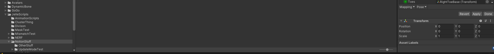

Contributors: [Jellejurre](https://jellejurre.dev/), [JustSleightly](https://vrc.sleightly.dev/)

# Avatar Rigs {#ffa86170db9f4850a8781e238c7d8fc3}

In Unity, Avatar Rigs provide a standardized way to interact with 3D models (`FBX` files). They are used to create Animator Layer Masks and, in the case of Humanoid Rigs, ensure animations are generic and compatible across multiple avatars.

To configure Avatar Rig settings, follow these steps:

1. **Open Model Inspector:**
	- Click on a 3D model in your Project view.
2. **Access Avatar Rig Tab:**
	- In the Model Inspector, click the `Rig` button. This opens the Avatar Rig tab.
3. **Select Avatar Rig Type:**
	- In the Avatar Rig tab, find a dropdown for the Avatar Rig Type.

 <GreyItalicText>The default window of the Model Inspector.</GreyItalicText>

There are four types of Avatar:

- **Humanoid**: The most popular Avatar, as VRChat’s default animations rely on this Avatar. It has a list of Humanoid bones, which can be mapped to Transforms (GameObjects). Once these bones are mapped, you can use Humanoid Muscles in animations to move the avatar in predictable ways. This allows an animation which animates Humanoid Muscles to work on any (VRChat) avatar as long as they have their (Unity) Avatar set up correctly.
- **Generic**: Like the Humanoid Avatar, but without all the humanoid bones/muscles. This avatar is only useful for creating Animator Layer Masks.
- **Legacy**: Doesn’t create an Avatar Rig at all, but it does import bones, animation and blendshapes, and also allows for changing the animation import method.
- **None**: Doesn’t create an Avatar Rig, doesn’t include any bones, animations or blendshapes.
---

## Humanoid Avatar {#a92616a516d147b88436eef439da4e82}

The `Avatar Definition` dropdown has two options:

- Copy From Other Avatar, shows a field in which one can drag another Avatar to copy the bone definition from.
- Create From This Model, shows a `x` or a `✓` based on whether the import has succeeded, and a `Configure` button which brings you to the Humanoid Rig Configure Screen.

The `Skin Weights` dropdown has two options:

- Standard (4 bones), which limits each vertex to be influenced by a maximum of 4 bone groups.
- Custom, which allows for editing of the maximum amount of bones per vertex, and the minimum bone weight to be imported.

 <GreyItalicText>The default Humanoid Rig Inspector.</GreyItalicText>

The `Optimize Game Objects` option (and the `Extra Transforms To Expose` menu) decide whether or not the bones will be exposed as GameObjects. If this option is enabled, all bones not enabled in Extra Transforms To Expose will be removed from any new instances of the FBX, and instead use internal representations will be used to increase performance.

---

## Configure Screen {#303eacda152948b6942075513df2554c}

When pressing the `Configure` button on a humanoid rig, the current scene will close (and reopen once you’re done) and the Humanoid Rig Configure Screen setup will be shown. In this screen you can edit how the 3d Model’s bones are mapped to Humanoid Bones.

At the top there are two sections: Mapping and Muscles & Settings.

### Mapping

The `Mapping` screen allows you to select which GameObject maps to which Humanoid Bone. There are four subheadings: Body, Head, Left Hand, Right Hand, each having their own set of bones to map.

At the bottom there are two dropdowns:

Mapping:

- **Clear**: Clears the whole avatar’s bone mapping
- **Automap**: Automatically assign the whole avatar’s bone mapping based on name and location
- **Save**: Save the current bone mapping to a file
- **Load**: Load the current bone mapping to a file

Pose:

- **Reset**: Reset the pose of the Avatar to the imported one
- **Sample Bind-Pose**: Try to set the pose of the avatar to the default position of the bones (the bind pose). This is usually the same as Reset.
- **Enforce T Pose**: Enforce a T Pose. The Avatar is required to be in a T pose when pressing `Apply` or `Done` to get a Humanoid Rig which works nicely with humanoid animations.

 <GreyItalicText>The Humanoid Rig Configure Mapping Screen. Note that the screen might not fit on your whole screen and might require scrolling, hence the two images.</GreyItalicText>

### Muscles & Settings

In this window, there are three sections:

- The first section is for previewing full Muscle Group movements by dragging the sliders. The `Reset All` button resets all the sliders to their neutral position.
- The second section is for previewing and editing the range of individual muscles. The range represents the angle that that bone can take when the muscle moves. So say a muscle has range `-180` - `180` and that muscle has value `0.75`, the bone would be rotated `90` degrees to the right.
- The third section is for overall settings.
	- Twist settings influence how much the twist muscle influences the neighboring bones.
	- Stretch settings influence how much the bones can stretch when the avatar is retargeted to another model.
	- Feet spacing is the default distance between the feet.
	- Translation DoF allows the Humanoid Rig to also move bones, instead of just rotating.
- `Muscles` → `Reset`: Resets the muscle ranges from the second tab to the defaults

Then the `Revert`, `Apply` and `Done` buttons:

- Revert the changes and leave the screen
- Apply the change and stay in this screen
- Apply the changes and leave the screen

 <GreyItalicText>The Humanoid Rig Configure Muscles & Settings Screen.</GreyItalicText>

---

## Generic Rig {#28d7a45653b0469384603cc487900755}

The  `Avatar Definition`,  `Skin Weights` and `Optimize Game Objects` dropdowns all do the same as with humanoid. 

The root node allows you to set a root node for Animations to play from.

---

## Legacy Rig {#7005c951d5a145998482ddd9ad0f213b}

The Legacy Rig has the same `Optimize Game Objects` toggle as the other Rigs, but it also has a dropdown where you can choose how to import animations, however, this is only for the old Legacy Unity Animation system, which is deprecated and should not be used anymore.

---

## None {#2cfd3cedc9994f6b9a5593fd7c5f5ad7}

No Rig means no skinning, no bones, no imported animations, and no blendshapes. This rig type is probably the most performant one for non-animated meshes.

---
<RightAlignedText>Last Updated: 31 March 2024 08:54:00</RightAlignedText>