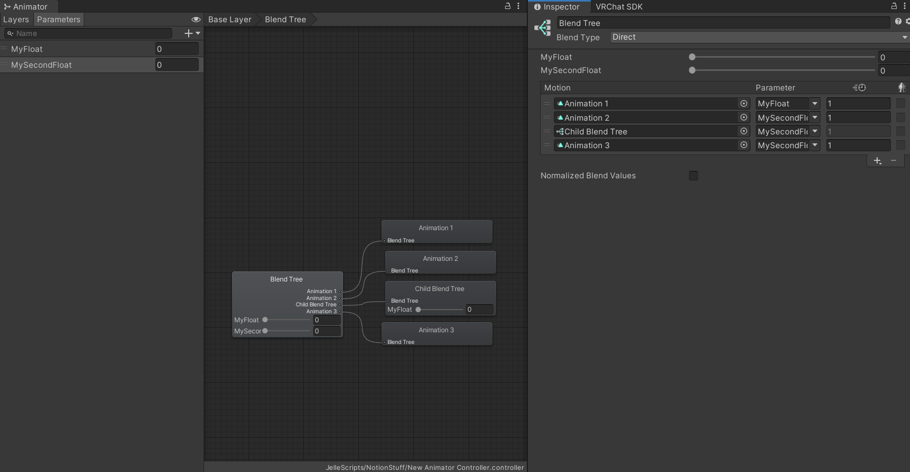

Contributors: [Jellejurre](https://jellejurre.dev/), [JustSleightly](https://vrc.sleightly.dev/)

# Blend Trees {#7cd27234cfaf48708ca543858e5ad615}

Blend Trees are a way of combining multiple Animation Clips together with different weights, based on the input parameters. A Blend Tree can have multiple children, which can be either Animation Clips, or other Blend Trees, which will be combined in different ways based on the blend tree type and input parameters.

To create a Blend Tree, `Right Click` in the Animator Controller Layer view, select `Create State → From new Blend Tree`, and assign it to the newly created Animator State.

Note: Blend Tree parameters must be Float Controller Parameters, but they can work with VRChat Bool/Int Expression Parameters. 

Refer to the [Expression Parameter Mismatching](/docs/Other/Parameter-Mismatching) page for more details.

To edit a Blend Tree, `Double Click` the Blend Tree’s Animator State to access the Blend Tree Editor. Here, you can modify the Blend Tree and its children. To return to the Layer View, click the breadcrumb menu at the top of the window.

In the Blend Tree Editor, a visual, node-based layout displays the entire blend tree structure, including children and their ordering. You can view and edit all parameters used by the blend tree and its children.

 <GreyItalicText>An Animator State with a Blend Tree as the Motion.</GreyItalicText>

---

## Editing Blend Trees {#eb62f63a0181496db7114a809df2e8fc}

Blend Trees consist of a list of `Motions`, which can be Animation Clips or other Blend Trees, blended together.

By default, the `Motion` list is empty, but you can add new fields by pressing the `+` icon at the bottom. This opens a dropdown where you can select `Add Motion Field` for an empty field to add an Animation Clip or `New Blend Tree` to create a new child Blend Tree.

Delete children by highlighting one and pressing the **`-`** button at the bottom of the **`Motion`** list.

At the top of the Blend Tree Inspector, there are 0, 1, or 2 parameters you can select or fill in yourself from the Animator Controller—limited to Float parameters.

For each child, if it’s an Animation Clip, set the Animation Clip's speed. Note that the actual length of the Animation Clip is now calculated as:

$$
Length(x) = (\sum_{c \in Clips} length_c / speed_c) / speed_x
$$

The actual length of the Animation Clip is calculated as the usual lengths of all Animation Clips, added together, divided by the speed of the individual clip.

 <GreyItalicText>A default (empty) blend tree.</GreyItalicText>

The `Thresholds` for the `Motions` are by default evenly spaced. Uncheck `Automate Thresholds` to edit them manually. Note that this list automatically reorders itself. With this checkbox disabled, you can automatically calculate the Thresholds based on values like Velocity or Angular Speed, though these are rarely used in practice.

---

## Blend Tree Types {#403c4cc02213497987b586df02ce0a11}

Blend Trees in Unity offer five types, each with its unique method of blending Animation Clips or other Blend Trees:

---

### 1D {#811c51972e5e4351b9baa7dcc7f060a4}

1 Directional (1D) Blend Trees blend motions based on a single parameter. The blend is linear, and the weight of each motion is determined by the parameter's value between the motion's thresholds. 

For example, if the parameter is 80% of the way between two thresholds:

- The leftmost motion is played with a weight of $(1-Fraction)$ = `(1 - 0.8)` = `0.2`
- The rightmost motion is played with a weight of $Fraction$ = `0.8`

Note that the visual editor above the Motion list can be used to set the parameter, or move the Motions around, simply by clicking and dragging either the red line, or the children’s Thresholds.

To be precise: if you have an animation animating something to value `A` at time `a` and value `B` at time `b`, then the output value at time `f` is as follows:

$$
Blend(f) = \begin{cases}
A  & \quad f \leq a \\
A * \frac{b - f}{b - a} + B * \frac{f-a}{b - a}  & \quad a \leq f \leq b \\
B  & \quad f \geq b
\end{cases}
$$

 <GreyItalicText>An example of a 1D Blend Tree. Since the value of 0.3 is 60% towards the second Motion, Animation 1 will be played with a weight of 0.4, and Animation 2 will be played with a weight of 0.6.</GreyItalicText>

---

### 2D Simple Directional {#e7bf65083f684e069242b0fde39bed1c}

2 Dimensional Simple Directional (2D Simple Directional) Blend trees blend motions based on a 2D parameter space where motions form a polygon around the center `(0,0)`. 

The weights for each motion are determined by:

- Finding the two points between which the parameter value lies.
- Checking if the value is further away from `(0,0)` than the line connecting the two points.
- If yes, using the distance to the two points as weights (normalized).
- If no, using the distance to the two points and the origin as weights (normalized).
- If there's a motion at `(0,0)`, it gets a third weight; otherwise, this weight is divided among other motions.

This is beneficial for character controllers or aim controllers, not for direct animation blending based on distance.

 <GreyItalicText>An example 2D Simple Directional Blend Tree. You can see that since the point in 2d space is equidistant from Animation 1 and Animation 2, they both get the same weight, and the rest gets equally divided between the other children, namely Child Blend Tree and Animation 3.</GreyItalicText>

---

### 2D Freeform Directional / 2D **Freeform Cartesian** {#70f974b1bd8d4c488452a580ecf2e825}

2 Dimensional Freeform Directional (2D Freeform Directional) / 2 Dimensional Freeform Cartesian (2D Freeform Cartesian)’s inner workings are based on chapter 6.3 and 6.3.1 of the following paper: [https://runevision.com/thesis/rune_skovbo_johansen_thesis.pdf](https://runevision.com/thesis/rune_skovbo_johansen_thesis.pdf).

The main differences between 2D Simple Directional, 2D Freeform Directional and 2D Freeform Cartesian are:
- **2D Simple Directional:** Suitable for using one Motion per direction.
- **2D Freeform Directional:** Requires a Motion at (0,0) and is ideal when more than one Motion per direction is needed. Works off Direction, similar to 1D Freeform Directional.
- **2D Freeform Cartesian:** Similar to a straightforward "Distance division = Weight division" function, offering a more direct approach to motion blending.
---

### Direct Blend Trees {#af73ae6839474624b626a2f401b9a8a4}

A Direct Blend Tree provides extensive control over individual Animation Clips or Blend Trees by assigning each a dedicated parameter. The played weight of each animation is determined by the value of its corresponding parameter. Notably, Direct Blend Trees offer the unique capability of playing multiple animations simultaneously, as the total weight is not restricted to 1.

This flexibility can be advantageous for optimizing VRChat toggles, allowing for more efficient animation layering. However, caution is advised, as playing an animation with a weight less than 1 will blend between the default value and the animated value. Instead, playing a 1D Blend Tree with a weight of 1 is generally preferable over directly playing an animation. This avoids reliance on default values and provides a more controlled animation blending process. For more information, check [Combining Layers Using Direct Blend Trees](/docs/Other/DBT-Combining). 

The `Normalize Blend Values` option, when enabled, normalizes the output weights of the animations. This means that all weights are divided by the total weight sum, ensuring that the total weight remains 1.

Example:

- Animation 1 is played with weight 2.
- Animation 2 is played with weight 3.
- With Normalize Blend Values enabled, Animation 1 will have a weight of 0.4, and Animation 2 will have a weight of 0.6 (normalized by the total weight of 2 + 3 = 5).

Note: a Write Defaults Off Direct Blend Tree behaves very differently, and should generally never be used. More information can be found at the [Write Defaults](/docs/Unity-Animations/Write-Defaults) page.

Very Technical Note: The time duration of clips in Direct Blend Trees works a bit differently than expected. When you have multiple clips, each with its own speed, the new length of every clip is its own length + the length of the other divided by their speed, divided by the original clip’s speed. So:

$$
l_{iNew} = \frac{l_{iOld} + \sum_{j != i} \frac{l_j}{s_j} }{s_i}
$$

Example, you have one clip with length 1 and speed 2, and another clips with length 5 and speed 4, the lengths in the DBT are: $l_1New = \frac{l_1Old + \frac{l_2}{s_2}}{s_1} = \frac{1 + \frac{5}{4}}{2} = \frac{9}{8}$ and  $l_2New = \frac{5 + \frac{1}{2}}{4} = \frac{11}{8}$

---
<RightAlignedText>Last Updated: 31 March 2024 08:54:00</RightAlignedText>