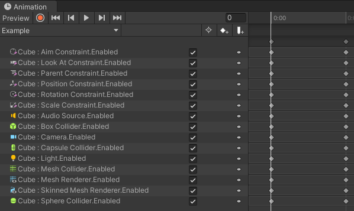

Contributors: [Jellejurre](https://jellejurre.dev/), [JustSleightly](https://vrc.sleightly.dev/)

# Types of Animation Clips {#93c1913e731f44a287d9455eb89562b4}

## Static vs Dynamic Clips {#c2b702ec119b4e02be31940b5364d67e}

**Static** clips are Animation Clips whose values do not change throughout the clip.

- These are often used when you need to make changes quickly/responsively
- _Examples: GameObject Toggles, Component Toggles, etc._

**Dynamic** clips are Animation Clips whose values do change throughout the clip.

	- These are often used when you want to blend between values within a clip
	- Consider whether you want **Loop Time** enabled or not when [Animation Clips](/docs/Unity-Animations/Animation-Clips)
	- _Examples: Dissolve Toggles, Hue Shifts, etc._

:::caution

Despite being static, it is good practice to make all Animation Clips at least two keyframes long even if the keyframes are identical, in order to give the animation clip an actual duration.

:::

---

## Types of Animations {#8939ac07c269461186761346b4ae52b4}

Below are some examples of properties you may commonly animate.

### GameObjects {#eabe979a09514f2eabe6c4360bee0cfb}

#### GameObject Toggle

By far the most common property for animations in VRChat. 

Very versatile for toggling whole branches of children, but may also not be the most performant way to toggle.

#### Transform Animations

Vectors can be animated per X/Y/Z individually as well.

:::caution

If animating Transform animations in **VRChat**, please refer to [Playable Layers](/docs/Avatars/Playable-Layers) for properly handling those.

:::

### Components {#dfdbcf8ea7224516b5ae460370361c11}

#### Component Toggles

Rather than toggle whole GameObjects and their children, some components can be toggled independently.

#### Component Properties

Component Properties can be animated as well! Examples include:

- Mesh BlendShape values for Facial Expressions
- Constraint weights, source weights, offsets, frozen axes, etc.
- Physics Rigidbody/Joint spring/drag/mass/drive/limit values, etc.
- Particle System emission rate, lifetime, velocity, etc.

### Materials  {#850404e4baef4288be7054f64e5bab49}

#### Material Properties

Materials have an endless number of animatable properties to work with. Shaders can designate their properties as animatable on a per-shader basis. A few commonly animated material properties applications include:

- Color Changes/Hue Shifts/Saturation/Brightness
- Texture Changes via Decal Animation
- Emission/Glitter/Rim Lighting Animations for Strength/Hue
- Dissolve/Tessellation Effects

:::note

Using Poiyomi Shader? Don’t forget to [mark your properties for Animation](https://www.poiyomi.com/general/locking#marking-properties-for-animation) in order for them to work! You can also generate custom animatable properties.

:::

#### Material Swaps

For when animating Material Properties isn’t enough, it is possible to animate an entirely different material into a mesh’s material slot.

Unlike other animation properties, MatSwaps are an object reference property, meaning that they animate specifically to an asset/file of a specific GUID. This makes them especially tedious to manually keyframe en-masse as each material reference needs to be dragged into the slot per keyframe. If the material reference no longer exists in the project, the property will animate to the default missing (pink) material.

 

:::caution

Since material swaps are object reference curves, they cannot be blended between and always behave as constant tangents.

:::

---
<RightAlignedText>Last Updated: 31 March 2024 08:54:00</RightAlignedText>