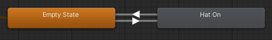

Contributors: [Jellejurre](https://jellejurre.dev/), [JustSleightly](https://vrc.sleightly.dev/)

# Write Defaults {#4dd2fc080652444bbe744c588c70c63f}

## Overview {#531817cd2f4b472cbf686a34048ddd3c}

`Write Defaults` is an option on Animator States, and a headache for many Avatar Creators, as they behave in weird and unexpected ways. The expected behaviour is as follows:

The `Write Defaults` field decides whether or not the changes made with this animation are persistent or not. 

If the `Write Defaults` field is enabled, the animated fields will return to their default state upon leaving the Animator State. 

If the `Write Defaults` field is disabled, the changes will stay.

By default, Unity enables Write Defaults on newly created states, but the sample Animator Controllers VRChat provides are Write Defaults Off.

 <GreyItalicText>The default animator state, which defaults to Write Defaults on.</GreyItalicText>

### Example: {#9fc09517f35f4d52b14538045d0626cb}

If you have a hat that is disabled in the hierarchy when starting the upload process (a.k.a. off by default), and you have a Layer that looks like this:

In the case of `Write Defaults On`:

- When going to the Hat On state, the hat would toggle on
- When going back to the Empty state, the hat would toggle off (since that is the default state being _written back_)

In the case of `Write Defaults Off`:

- When going to the Hat On state, the hat would toggle on
- When going to the Empty state, the hat would stay toggled on (since you’re not explicitly toggling it back off or _writing back the default_)

---

## Guidelines {#303ea6798f474b97b60f6266a9d2808e}

There are a few guidelines to follow when using `Write Defaults` `Off`. Afterwards I will explain why these guidelines exist, just for completeness’ sake:

- Don’t mix `Write Defaults` in a single controller. Mixed Write Defaults will behave like WD off.
	- The exception to this is layers with a single state in them. These can, and in the case of Direct Blend Trees, should be set to `Write Defaults On`.
	- It is okay to do this since they never leave their state, and therefore, we never rely on the WD On behaviour.
- Don’t use `Write Defaults Off` on Direct Blend Trees
- If you are using `Write Defaults Off`, all your states should have an Animation Clip or a Blend Tree in them. This Animation Clip can be empty, but it is generally recommended to use an Animation Clip that animates a GameObject that does not exist for two frames (sometimes called a _buffer_ clip).
- Note that animating a Transform animation with `Write Defaults Off` overrides all other animated Transforms from other playing Animator Controllers. This specifically means that, for VRChat, if you are animating any Transform in the FX Layer, it will overwrite all Transforms in the Gesture layer, unless you apply an <u>Avatar Mask</u> that enables only the animated Transforms and disables all others, and apply this mask to your FX Layer Animation Layer. More information about Masking can be found at the [Avatar Masks](/docs/Avatars/Avatar-Masks) page.

:::caution

If you have to use masks due to WD off Transform animations in both your Gesture and FX layers, you can’t use matswaps on any slot but the first one, since a masked transform (whether it’s masked on or off) can’t have animated matswaps apart from the first material slot.

:::

:::tip

A useful tool to check if you are breaking these rules (at least the first and third rule) is the [VRLabs’ Avatar 3.0 Manager](https://github.com/VRLabs/Avatars-3.0-Manager). 

In the Write Defaults tab of this tool, it will tell you if you have mixed Write Defaults and set them for you if you press the corresponding button. Do note that it doesn’t make an exception for Direct Blend Trees, so their animator state has to have `(WD On)` in its name to mark it as Write Defaults On.

:::

 <GreyItalicText>An example Animation Clip to ensure no empty States remain.</GreyItalicText>

## Explanations {#19ee91c0a2444c319fc55747a2a5fc20}

### Don’t mix Write Defaults in a single controller {#3e8ec73c833b45d981d2ed38e6469bd8}

Playing a single `Write Defaults Off` state will cause all other `Write Defaults On` States to not write their default values, and thus behave in a `Write Defaults Off` manner.

### Don’t use Write Defaults Off on Direct Blend Trees {#0b3fc5d39b1b49c884bc9b7e89139546}

`Write Defaults Off` Direct Blend Trees will display weird behaviour, like influencing other Direct Blend Trees that use the same Parameters in them, and also multiplying their results over time, causing unexpected results. They should, in general, never be used. 

To clarify the multiplying behaviour a bit, the final result is that, in a `Write Defaults Off` Blend Tree, the final weights get multiplied by a factor of _x/(1-yx)_ where x is the weight of the current child at and y is the sum of the weight of the other children, divided by the weight of the current child. Note that if the denominator of this fraction is 0 or lower, the values go to infinity and never stop adding. This means that if you have n children, and you set the weight of every child to 1/n, then the final result is that the multiplier is 1, and therefore this allows you to use `Write Defaults Off` Direct Blend Trees. This doesn’t mean it’s advisable though, as the affecting-other-Blend-Trees and other weird behaviour make it a lot easier to just use `Write Defaults On`.

### When using Write Defaults Off, all states should have an Animation Clip or a Blend Tree {#ac6f75b31d6540a08a48b7231c8de0fd}

`Write Defaults Off` States without an Motion in them can overwrite Animation Clips in previous layers with the default value of the Animation Clip in the Animator State they came from.

---

## Pros/Cons {#447ffbb9a8194989bb2badd08a8d514e}

### Write Defaults On {#eb4ca8a271f94e4a9925769ed1815c1f}

Pros:

- Less complicated since you can have empty states/buffer states which fall back to the default upload behaviour
- Allows for transform animations on the FX layer without overwriting the Gesture layer
- 33% decrease in frametime over WD Off for basic 2 state toggles (in Unity 2019)
- Easier changing of defaults (if you rely on upload state)

Cons:

- Relies on upload state
- Generally breaks when using Mixed Write Defaults
- Doesn’t allow for sequential operations without the use of Parameter Drivers or AAPs

### Write Defaults Off {#35e5f14457614eef9e56462b8f955e20}

Pros:

- Doesn’t rely on upload state
- Is generally fine with Mixed Write Defaults
- Allows for sequential operations

Cons: 

- Need Buffer animations in empty states
- Overwrites all Gesture transforms when animating a transform without a mask
- 50% increase in frametime over WD On for basic 2 state toggles (in Unity 2019)

---

## Guidelines for Creators {#de856424b59e41e390ebda5eab6ce12f}

These guidelines are useful when creating prefabs that should be compatible with both `Write Defaults On` and `Write Defaults Off`:

- Always have each layer always animate one set of properties by its own (e.g. every state in the layer should animate the same set of properties).
- If you _need_ to animate a property on multiple layers, make sure every state has an animation in it, know that lower layers overwrite higher layers, and always have a Reset layer at the top with the default state.

If you follow the guidelines outlined in this article, every property is always animated, and your system will always work with both `Write Defaults On` and `Write Defaults Off`. 

---

### Blendshape Values Tripling {#778f79bd28374abbabda8b86acfa7699}

In very specific conditions, Blendshape values triple when relying on `Write Defaults On`

(Example: you have an empty `Write Defaults On` state, which transitions into a Blendshape-animating `Write Defaults On` state. The defaults value of the animated Blendshape get multiplied by 3 when in the empty `Write Defaults On` state).

This issue is a bit more finnickey and less clear than the rest, so don’t take what we say here as fact, but more as observations:

- It seems to be caused by the Additive layer with it being `Write Defaults Off`.
- It is blocked by having a Gesture layer with only `Write Defaults Off` states (like the default ones). A single playing `Write Defaults On` state will cause it to happen again.
- It is independent from any masking and from the animation actually being reachable. Just existing on the layer is enough.
- It doesn’t impact behaviour as long as you are only using values 0 and 100, since 0*3=0 and 100*3=100 (due to Blendshape clamping, you can enable this in your unity project by going to Project Settings → Player → Other Settings → Clamp Blendshapes (Deprecated). This is enabled in VRChat).
- The proper way to fix this is by always explicitly animating the Blendshape value.
- A quick and dirty way to fix this is to set the states in your idle layer to `Write Defaults On`.

---
<RightAlignedText>Last Updated: 17 May 2024 14:14:00</RightAlignedText>